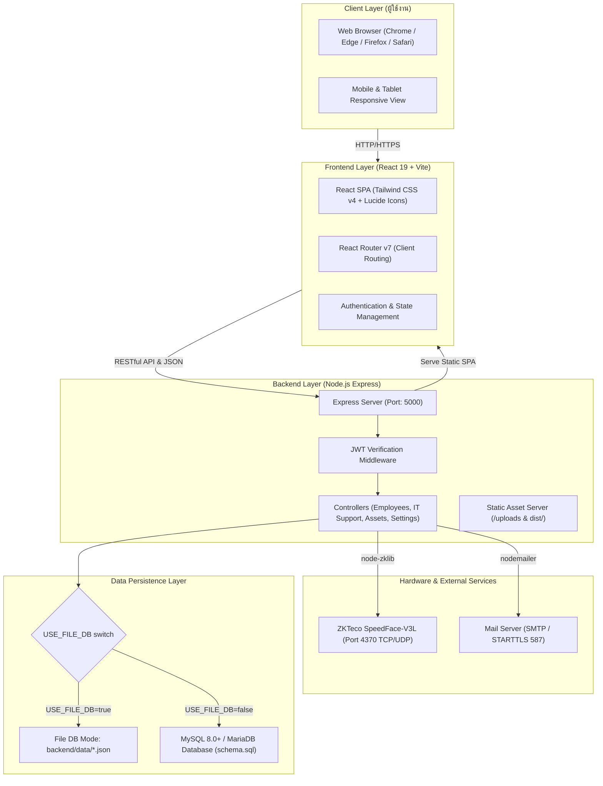
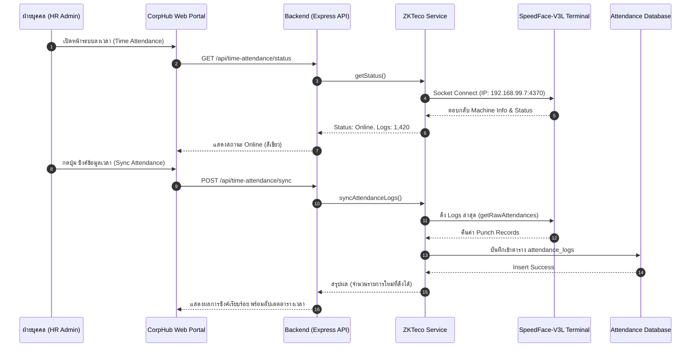

# คู่มือการติดตั้งและการเชื่อมต่อระบบ CorpHub Enterprise Portal
(CorpHub Setup & Connection Guide)

เอกสารฉบับนี้จัดทำขึ้นสำหรับ System Administrator, DevOps Engineer, และทีมพัฒนาระบบ เพื่อใช้เป็นคู่มือมาตรฐานในการติดตั้ง กำหนดค่าเชื่อมต่อ (Configuration) และบริหารจัดการระบบ **CorpHub - Enterprise Resource & Management Portal** ครอบคลุมตั้งแต่สภาพแวดล้อม Development จนถึง Production

---

## สารบัญ (Table of Contents)

1. [ภาพรวมสถาปัตยกรรมระบบ (Architecture Overview)](#1-ภาพรวมสถาปัตยกรรมระบบ-architecture-overview)
2. [ความต้องการของระบบ (System Requirements)](#2-ความต้องการของระบบ-system-requirements)
3. [โครงสร้างไดเรกทอรีของโปรเจกต์ (Project Directory Structure)](#3-โครงสร้างไดเรกทอรีของโปรเจกต์-project-directory-structure)
4. [การกำหนดค่าคอนฟิก (.env Configuration)](#4-การกำหนดค่าคอนฟิก-env-configuration)
   - [4.1 Backend Environment (.env)](#41-backend-environment-env)
   - [4.2 Frontend Environment (.env)](#42-frontend-environment-env)
5. [กลยุทธ์และการสลับโหมดฐานข้อมูล (Database Mode Switching)](#5-กลยุทธ์และการสลับโหมดฐานข้อมูล-database-mode-switching)
   - [5.1 โหมด File DB Simulator (ไม่ต้องติดตั้ง MySQL)](#51-โหมด-file-db-simulator-ไม่ต้องติดตั้ง-mysql)
   - [5.2 โหมด MySQL / MariaDB (ระบบฐานข้อมูลจริง)](#52-โหมด-mysql--mariadb-ระบบฐานข้อมูลจริง)
   - [5.3 การเปรียบเทียบโหมด File DB vs MySQL](#53-การเปรียบเทียบโหมด-file-db-vs-mysql)
6. [ขั้นตอนการนำเข้าฐานข้อมูล (Import schema.sql เข้า MySQL)](#6-ขั้นตอนการนำเข้าฐานข้อมูล-import-schemasql-เข้า-mysql)
   - [6.1 การสร้างฐานข้อมูลและกำหนด Collation](#61-การสร้างฐานข้อมูลและกำหนด-collation)
   - [6.2 การ Import ผ่าน Command Line Interface (CLI)](#62-การ-import-ผ่าน-command-line-interface-cli)
   - [6.3 การ Import ผ่าน GUI (phpMyAdmin / MySQL Workbench / DBeaver)](#63-การ-import-ผ่าน-gui-phpmyadmin--mysql-workbench--dbeaver)
   - [6.4 การตรวจสอบความถูกต้องของตารางและข้อมูลเริ่มต้น](#64-การตรวจสอบความถูกต้องของตารางและข้อมูลเริ่มต้น)
7. [การเชื่อมต่อเครื่องสแกนใบหน้าและลายนิ้วมือ ZKTeco SpeedFace-V3L](#7-การเชื่อมต่อเครื่องสแกนใบหน้าและลายนิ้วมือ-zkteco-speedface-v3l)
   - [7.1 ข้อมูลทางเทคนิคและการเตรียมระบบเครือข่าย](#71-ข้อมูลทางเทคนิคและการเตรียมระบบเครือข่าย)
   - [7.2 การตั้งค่า IP Address ที่ตัวเครื่อง SpeedFace](#72-การตั้งค่า-ip-address-ที่ตัวเครื่อง-speedface)
   - [7.3 การทดสอบการสื่อสาร (Network Ping & Port Test)](#73-การทดสอบการสื่อสาร-network-ping--port-test)
   - [7.4 การทำงานของโมดูล ZKTeco Service และ Time Attendance](#74-การทำงานของโมดูล-zkteco-service-และ-time-attendance)
8. [การตั้งค่าระบบส่งอีเมล (Email SMTP Configuration)](#8-การตั้งค่าระบบส่งอีเมล-email-smtp-configuration)
   - [8.1 รูปแบบการตั้งค่า SMTP สำหรับ IT Support และ HR](#81-รูปแบบการตั้งค่า-smtp-สำหรับ-it-support-และ-hr)
   - [8.2 การตั้งค่าร่วมกับ Gmail / Google Workspace](#82-การตั้งค่าร่วมกับ-gmail--google-workspace)
   - [8.3 การตั้งค่าร่วมกับ Microsoft 365 / Corporate SMTP](#83-การตั้งค่าร่วมกับ-microsoft-365--corporate-smtp)
   - [8.4 การทดสอบการส่งอีเมล (SMTP Test)](#84-การทดสอบการส่งอีเมล-smtp-test)
9. [ขั้นตอนการสั่งรันระบบ (Running the Application)](#9-ขั้นตอนการสั่งรันระบบ-running-the-application)
   - [9.1 โหมดพัฒนา (Development Mode)](#91-โหมดพัฒนา-development-mode)
   - [9.2 โหมดใช้งานจริง (Production Build & Standalone Server)](#92-โหมดใช้งานจริง-production-build--standalone-server)
   - [9.3 การติดตั้งและควบคุมเป็น Windows Service หรือ PM2 Process Manager](#93-การติดตั้งและควบคุมเป็น-windows-service-หรือ-pm2-process-manager)
   - [9.4 การตั้งค่า Nginx Reverse Proxy และ HTTPS SSL](#94-การตั้งค่า-nginx-reverse-proxy-และ-https-ssl)
10. [การตรวจสอบและแก้ไขปัญหาเบื้องต้น (Troubleshooting)](#10-การตรวจสอบและแก้ไขปัญหาเบื้องต้น-troubleshooting)

---

## 1. ภาพรวมสถาปัตยกรรมระบบ (Architecture Overview)

CorpHub ถูกออกแบบขึ้นภายใต้สถาปัตยกรรม **Decoupled Client-Server & Standalone Capable Architecture** ซึ่งมีความยืดหยุ่นสูง สามารถรันแยกพอร์ตระหว่าง Dev ได้ หรือจะรวม Build เป็น Standalone Single-Port Application ในฝั่ง Production ได้ทันที



### องค์ประกอบหลักของระบบ:
1. **Frontend**:
   - พัฒนาด้วย **React 19** ควบคู่กับ **Vite 8** ให้ความเร็วในการ Hot-reload ระดับมิลลิวินาที
   - ตกแต่งส่วนติดต่อผู้ใช้ด้วย **Tailwind CSS v4** สไตล์ Modern Clean Enterprise UI
   - จัดการ Routing ฝั่ง Client ด้วย **React Router v7**
   - แสดงผลกราฟิกและสถิติด้วย **Recharts**
   - ไอคอนอินเตอร์เฟซมาตรฐาน **Lucide React**
   - กล่องโต้ตอบแจ้งเตือนมาตรฐาน **SweetAlert2**
2. **Backend**:
   - พัฒนาด้วย **Node.js (Express 5)**
   - ระบบความปลอดภัยและการยืนยันตัวตนด้วย **JSON Web Tokens (JWT)** และการเข้ารหัสรหัสผ่าน **bcryptjs**
   - การจัดการไฟล์อัปโหลดด้วย **multer** จัดเก็บในโฟลเดอร์ `backend/uploads/`
   - ไดรเวอร์เชื่อมต่อ MySQL ประสิทธิภาพสูง **mysql2/promise** พร้อมระบบ Connection Pool
   - ไลบรารีเชื่อมต่อเครื่องสแกนชีวมิติ **node-zklib** ผ่าน Network Socket
   - บริการส่งแจ้งเตือนและข้อความผ่าน **nodemailer**
3. **Storage & Hybrid Database Engine**:
   - **File DB Engine**: ระบบจำลองฐานข้อมูลผ่านไฟล์ JSON ในไดเรกทอรี `backend/data/` สะดวกสำหรับการเดโมและทดสอบโดยไม่ต้องติดตั้ง MySQL Server
   - **Production Relational DB**: ฐานข้อมูล **MySQL / MariaDB** รองรับความสัมพันธ์แบบ Foreign Keys, Transactions และ Indexing ตามโครงสร้างใน `schema.sql`

---

## 2. ความต้องการของระบบ (System Requirements)

### 2.1 ฮาร์ดแวร์เซิร์ฟเวอร์ขั้นต่ำ (Minimum Hardware Requirements)
- **CPU**: 2 Cores ขึ้นไป (แนะนำ 4 Cores สำหรับ Production)
- **RAM**: 4 GB ขึ้นไป (แนะนำ 8 GB ขึ้นไป หากรันร่วมกับ MySQL Server)
- **Disk Storage**: 20 GB พื้นที่ว่าง (SSD แนะนำเพื่อประสิทธิภาพการ I/O)
- **Network Interface**: 100/1000 Mbps Ethernet LAN Card เชื่อมต่อวงเครือข่ายเดียวกับเครื่องสแกนใบหน้า

### 2.2 ซอฟต์แวร์ที่ต้องติดตั้ง (Software Requirements)
| รายการซอฟต์แวร์ | เวอร์ชันที่รองรับ | แนะนำ | หมายเหตุ |
| :--- | :--- | :--- | :--- |
| **Operating System** | Windows 10/11 / Windows Server 2016+, Ubuntu 20.04+, Debian 11+ | Windows Server 2022 หรือ Ubuntu 22.04 LTS | รองรับได้ทั้ง Windows และ Linux |
| **Node.js Runtime** | Node.js 18.x LTS ขึ้นไป | **Node.js 20.x หรือ 22.x LTS** | ตรวจสอบด้วยคำสั่ง `node -v` |
| **Package Manager** | npm v9+ | npm v10+ | มาพร้อมกับการติดตั้ง Node.js |
| **Database Server** | MySQL 8.0+ หรือ MariaDB 10.4+ | MySQL 8.0.35+ หรือ MariaDB 10.11+ | จำเป็นเมื่อตั้งค่า `USE_FILE_DB=false` |
| **Process Manager** | PM2 หรือ Windows Service (NSSM) | PM2 (v5.x+) | สำหรับควบคุม Backend Service ใน Production |
| **Web Server (Optional)** | Nginx 1.20+ หรือ IIS 10+ | Nginx | สำหรับการทำ Reverse Proxy และ SSL Offloading |

---

## 3. โครงสร้างไดเรกทอรีของโปรเจกต์ (Project Directory Structure)

```text
corp_hub/
├── backend/                        # โค้ดส่วน Backend API (Node.js Express)
│   ├── config/                     # โมดูลคอนฟิกูเรชัน
│   │   └── db.js                   # การสลับโหมด File DB / MySQL Pool
│   ├── controllers/                # จัดการ Business Logic แต่ละโมดูล
│   │   ├── announcementController.js
│   │   ├── assetController.js
│   │   ├── authController.js
│   │   ├── bccGroupsController.js
│   │   ├── categoriesController.js
│   │   ├── emailSettingsController.js
│   │   ├── employeeController.js
│   │   ├── hostingController.js
│   │   ├── itHealthController.js
│   │   ├── itSupportController.js
│   │   ├── networkController.js
│   │   ├── settingsController.js
│   │   └── timeAttendanceController.js
│   ├── data/                       # ไฟล์ฐานข้อมูลจำลอง (เมื่อรันในโหมด File DB)
│   │   ├── announcements.json
│   │   ├── employees.json
│   │   ├── email_settings.json
│   │   └── ... (ตารางข้อมูล JSON ทั้งหมด 19 คอลเลกชัน)
│   ├── middlewares/                # มิดเดิลแวร์สำหรับตรวจสอบความถูกต้อง
│   │   ├── authMiddleware.js       # ตรวจสอบสิทธิ์และแกะ JWT Token
│   │   └── roleMiddleware.js       # ควบคุม Role-Based Access Control
│   ├── routes/                     # กำหนดเส้นทาง Express API Routes
│   ├── services/                   # เซอร์วิสเฉพาะทาง
│   │   └── zktecoService.js        # สื่อสารกับเครื่องสแกนใบหน้า SpeedFace-V3L
│   ├── uploads/                    # จัดเก็บไฟล์ที่อัปโหลด (รูปโปรไฟล์, สลิป, ไฟล์แนบ)
│   ├── .env                        # ไฟล์คอนฟิกตัวแปรสภาพแวดล้อมจริงของ Backend
│   ├── .env.example                # ตัวอย่างการตั้งค่าสภาพแวดล้อม Backend
│   ├── package.json                # ข้อมูลแพ็กเกจและ Scripts ของ Backend
│   └── server.js                   # Entry point ของระบบ Backend และ Single-port Serve
│
├── frontend/                       # โค้ดส่วน Frontend (React Vite Tailwind)
│   ├── dist/                       # ไดเรกทอรีที่ได้จากการ Build สำหรับ Production
│   ├── public/                     # Static Assets เช่น โลโก้, Favicon
│   ├── src/                        # ซอร์สโค้ด React
│   │   ├── components/             # Reusable UI Components
│   │   │   ├── common/             # Button, Modal, Card, Input ทั่วไป
│   │   │   └── layout/             # Header, Sidebar, AdminLayout
│   │   ├── config/                 # ค่าคอนฟิก URL ฝั่งไคลเอนต์ (api.js)
│   │   ├── pages/                  # หน้าจอแต่ละฟังก์ชันการทำงาน
│   │   ├── services/               # ฟังก์ชันเรียก API
│   │   ├── App.jsx                 # ตัวควบคุม Routing หลัก
│   │   └── main.jsx                # จุดเริ่มต้นการเรนเดอร์ React DOM
│   ├── .env                        # ไฟล์คอนฟิกค่าตัวแปร Frontend
│   ├── .env.example                # ตัวอย่างคอนฟิก Frontend
│   ├── package.json                # ข้อมูลแพ็กเกจและ Scripts ฝั่ง Frontend
│   └── vite.config.js              # ค่าคอนฟิกของ Vite Build Tool
│
├── docs/                           # ไดเรกทอรีจัดเก็บเอกสารและคู่มือระบบ
│   └── Setup_and_Connection_Guide.md
├── schema.sql                      # DDL โครงสร้างฐานข้อมูลสำหรับ MySQL
└── README.md                       # เอกสารสรุปภาพรวมและ Quick Start Guide
```

---

## 4. การกำหนดค่าคอนฟิก (.env Configuration)

ระบบ CorpHub ใช้ระบบ Environment Variables ผ่านไฟล์ `.env` ในการแยกการตั้งค่าระหว่างเครื่องทดสอบและเซิร์ฟเวอร์จริง

### 4.1 Backend Environment (`backend/.env`)

คัดลอกจากไฟล์ต้นแบบ:
```bash
cd backend
cp .env.example .env
```

คำอธิบายตัวแปรทั้งหมดใน `backend/.env`:

| ตัวแปร (Variable) | ประเภท | ค่าเริ่มต้น (Default) | ตัวอย่างค่า Production | คำอธิบายโดยละเอียด |
| :--- | :---: | :---: | :---: | :--- |
| **PORT** | Integer | `5000` | `5000` | พอร์ต TCP ที่ Backend Express Server จะใช้เปิดให้บริการ |
| **USE_FILE_DB** | Boolean | `true` | `false` | **สวิตช์โหมดฐานข้อมูล**: <br>- `true`: ใช้ระบบจำลอง JSON File DB ในโฟลเดอร์ `backend/data` <br>- `false`: เชื่อมต่อ MySQL/MariaDB จริงตามค่า DB_* ด้านล่าง |
| **DB_HOST** | String | `localhost` | `127.0.0.1` หรือ `db.internal.lan` | หมายเลข IP หรือ Hostname ของเครื่องแม่ข่ายฐานข้อมูล MySQL |
| **DB_PORT** | Integer | `3306` | `3306` | พอร์ตของฐานข้อมูล MySQL (ค่ามาตรฐานคือ 3306) |
| **DB_USER** | String | `root` | `corphub_app` | ชื่อผู้ใช้งานฐานข้อมูลที่มีสิทธิ์ Read/Write ตารางในระบบ |
| **DB_PASSWORD** | String | (ว่าง) | `P@ssw0rdSecure!2026` | รหัสผ่านผู้ใช้งานฐานข้อมูล |
| **DB_NAME** | String | `ascg_g_db` | `ascg_g_db` | ชื่อ Database Schema ใน MySQL ที่ทำการ Import `schema.sql` |
| **JWT_SECRET** | String | (สุ่มข้อความ) | `c0rpHub#Secr3t$2026_XyZ987!` | คีย์ลับ (Secret Key) สำหรับเซ็นรับรองความถูกต้องของ JWT Token **ต้องเปลี่ยนให้ปลอดภัยในโหมด Production** |
| **JWT_EXPIRES_IN** | String | `30d` | `8h` หรือ `30d` | อายุการใช้งานของ Token ก่อนหมดอายุ เช่น `1h` (1 ชั่วโมง), `8h` (8 ชั่วโมง), `30d` (30 วัน) |
| **ZKTECO_IP** | String | `192.168.99.7` | `192.168.99.7` | หมายเลข IP Address ของเครื่องสแกนหน้า/ลายนิ้วมือ ZKTeco SpeedFace-V3L ในวงแลน |
| **ZKTECO_PORT** | Integer | `4370` | `4370` | พอร์ตสื่อสาร Socket ของเครื่อง ZKTeco (ค่ามาตรฐานของโรงงานคือ 4370) |

ตัวอย่างเนื้อหาไฟล์ `backend/.env` ที่พร้อมใช้งาน:
```env
# ==========================================
# CorpHub Backend Environment Configuration
# ==========================================

# Server Listening Port
PORT=5000

# Database Mode Switching (true: File DB, false: MySQL)
USE_FILE_DB=true

# Database Credentials (Active when USE_FILE_DB=false)
DB_HOST=localhost
DB_PORT=3306
DB_USER=root
DB_PASSWORD=
DB_NAME=ascg_g_db

# Security & Authentication
JWT_SECRET=CorpHubEnterpriseSecretKey2026!@#$%^
JWT_EXPIRES_IN=30d

# ZKTeco SpeedFace-V3L Biometric Hardware
ZKTECO_IP=192.168.99.7
ZKTECO_PORT=4370
```

---

### 4.2 Frontend Environment (`frontend/.env`)

คัดลอกจากไฟล์ต้นแบบ:
```bash
cd frontend
cp .env.example .env
```

คำอธิบายตัวแปรใน `frontend/.env`:

| ตัวแปร (Variable) | รูปแบบที่แนะนำ | ตัวอย่างค่า | คำอธิบาย |
| :--- | :--- | :--- | :--- |
| **VITE_API_BASE_URL** | พัฒนาในเครื่อง (Dev) | `http://localhost:5000` | ระบุชี้ไปยัง Express Backend พอร์ต 5000 เมื่อรัน `npm run dev` แยกสองหน้าต่าง |
| | ผลิตและใช้งานจริง (Standalone) | `` (เว้นว่างไว้) | หากให้ Express ทำหน้าที่ Serve ไฟล์ Static Build ของ React ในพอร์ตเดียวกัน ให้เว้นว่างไว้ ระบบจะใช้ Relative Path (`/api`) อัตโนมัติ |
| | มีโดเมนหรือ Nginx Reverse Proxy | `` (เว้นว่างไว้) หรือ `https://portal.company.com` | โดเมนภายนอกผ่าน Reverse Proxy หรือ SSL |

ตัวอย่างไฟล์ `frontend/.env` สำหรับ Development:
```env
# Frontend Local Development
VITE_API_BASE_URL=http://localhost:5000
```

ตัวอย่างไฟล์ `frontend/.env` สำหรับ Standalone Production Build:
```env
# Standalone Production (Leave empty to use current host/origin)
VITE_API_BASE_URL=
```

---

## 5. กลยุทธ์และการสลับโหมดฐานข้อมูล (Database Mode Switching)

CorpHub มีฟีเจอร์เด่นเรื่อง **Dual-Engine Architecture** สามารถทำงานได้สองโหมดผ่านตัวแปร `USE_FILE_DB` ใน `backend/.env`

### 5.1 โหมด File DB Simulator (`USE_FILE_DB=true`)
- **การทำงาน**: ระบบจะไม่ต่อเชื่อมไปยัง MySQL Server แต่จะอ่านและเขียนข้อมูลลงไฟล์ `.json` ในโฟลเดอร์ `backend/data/` โดยตรง
- **ข้อดี**:
  - ติดตั้งง่าย ไม่ต้องลงโปรแกรม MySQL Server หรือ Docker ให้ยุ่งยาก
  - เหมาะสำหรับเครื่อง Dev, เครื่องทดสอบ, หรือการนำเสนองาน (Demonstration)
  - ข้อมูลคงอยู่แม้รีสตาร์ตเซิร์ฟเวอร์ (Persistent JSON files)
  - มีข้อมูลตัวอย่างเบื้องต้น เช่น รายชื่อบริษัท, แผนก, พนักงาน, บัญชีแอดมิน ให้พร้อมใช้งานทันที

### 5.2 โหมด MySQL / MariaDB (`USE_FILE_DB=false`)
- **การทำงาน**: ระบบจะทำการสร้าง Connection Pool ผ่าน `mysql2/promise` และส่งคำสั่ง SQL ไปประมวลผลที่ฐานข้อมูล MySQL
- **ข้อดี**:
  - รองรับปริมาณข้อมูลสูงและจำนวนผู้ใช้งานพร้อมกัน (Concurrent Users)
  - มีความถูกต้องของข้อมูลตามกฎ Referential Integrity (Foreign Keys, Triggers, Cascades)
  - รองรับการทำ Transaction (Commit/Rollback) และ Backup/Restore ระดับ Enterprise
  - รองรับการทำ Replication และ Clustering

### 5.3 การเปรียบเทียบโหมด File DB vs MySQL

| หัวข้อเปรียบเทียบ | File DB Simulator (`USE_FILE_DB=true`) | MySQL / MariaDB (`USE_FILE_DB=false`) |
| :--- | :--- | :--- |
| **ความสะดวกในการติดตั้ง** | ไม่ต้องติดตั้ง DB เพิ่ม รันได้ทันที | ต้องติดตั้ง MySQL Server และ Import schema |
| **ที่จัดเก็บข้อมูล** | `backend/data/*.json` | ตารางฐานข้อมูล InnoDB บน MySQL Storage |
| **ความเสถียรกับการใช้งานพร้อมกัน** | เหมาะกับการใช้งานเดี่ยว (Single Process) | สูงมาก รองรับ Multi-Threading & Pooling |
| **ความสัมพันธ์ของข้อมูล (Foreign Keys)**| ควบคุมผ่านโค้ดในระดับ Application | ควบคุมโดย Database Engine ป้องกันข้อมูลกำพร้า |
| **สภาพแวดล้อมที่เหมาะสม** | Local Development, Staging, Demo | Production Environment, Live Enterprise |

---

## 6. ขั้นตอนการนำเข้าฐานข้อมูล (Import schema.sql เข้า MySQL)

เมื่อต้องการใช้งานโหมด MySQL (`USE_FILE_DB=false`) ให้ดำเนินการตามขั้นตอนดังต่อไปนี้:

### 6.1 การสร้างฐานข้อมูลและกำหนด Collation

เปิด MySQL Terminal หรือ Client Tool แล้วสร้างฐานข้อมูลที่มีชื่อว่า `ascg_g_db` โดยต้องตั้งค่าชุดอักขระเป็น **utf8mb4** เพื่อรองรับภาษาไทย สัญลักษณ์พิเศษ และ Emoji ได้อย่างถูกต้อง:

```sql
CREATE DATABASE IF NOT EXISTS `ascg_g_db` 
CHARACTER SET utf8mb4 
COLLATE utf8mb4_unicode_ci;
```

---

### 6.2 การ Import ผ่าน Command Line Interface (CLI)

1. เปิด Terminal หรือ PowerShell แล้วไปยัง Root Directory ของโปรเจกต์:
   ```bash
   cd c:\Users\keerakiat.k\Desktop\corp_hub
   ```
2. สั่งคำสั่ง Import ไฟล์ `schema.sql` เข้าไปยังฐานข้อมูล:
   ```bash
   # สำหรับ Windows Command Prompt / Linux Bash:
   mysql -u root -p ascg_g_db < schema.sql

   # หรือหากผู้ใช้ไม่มีรหัสผ่าน (Local XAMPP/WampServer ค่าเริ่มต้น):
   mysql -u root ascg_g_db < schema.sql
   ```
3. กรอกรหัสผ่าน MySQL เมื่อระบบสอบถาม

---

### 6.3 การ Import ผ่าน GUI (phpMyAdmin / MySQL Workbench / DBeaver)

#### วิธีนำเข้าผ่าน phpMyAdmin:
1. เปิดบราวเซอร์ไปที่ `http://localhost/phpmyadmin`
2. กดเมนู **New** ด้านซ้าย ตั้งชื่อฐานข้อมูล `ascg_g_db` เลือก Collation เป็น `utf8mb4_unicode_ci` แล้วกด **Create**
3. คลิกเลือกฐานข้อมูล `ascg_g_db` จากแถบด้านซ้าย
4. คลิกแท็บ **Import** ที่เมนูด้านบน
5. กดปุ่ม **Browse (เลือกไฟล์)** แล้วเลือกไฟล์ `schema.sql` ที่อยู่ที่ Root ของโปรเจกต์
6. ตรวจสอบว่า Character Set เป็น `utf-8` แล้วเลื่อนลงด้านล่างสุดกดปุ่ม **Import (หรือ ดำเนินการ)**

#### วิธีนำเข้าผ่าน MySQL Workbench:
1. เปิดโปรแกรม MySQL Workbench แล้วเชื่อมต่อไปยัง Local Connection
2. ไปที่เมนู **Server** -> **Data Import**
3. เลือกตัวเลือก **Import from Self-Contained File** แล้วเบราว์สหาไฟล์ `schema.sql`
4. ในช่อง **Default Target Schema** ให้เลือกฐานข้อมูล `ascg_g_db` (หากยังไม่มีให้คลิกปุ่ม New เพื่อสร้าง)
5. คลิกปุ่ม **Start Import** ที่มุมขวาล่าง

---

### 6.4 การตรวจสอบความถูกต้องของตารางและข้อมูลเริ่มต้น

เมื่อ Import สำเร็จ ฐานข้อมูลจะมีโครงสร้างตารางทั้งหมด **19 ตาราง**:

```sql
USE ascg_g_db;
SHOW TABLES;
```

รายชื่อตารางหลักในระบบ:
1. `announcements` - รายการประกาศข่าวสารองค์กร
2. `announcement_types` - หมวดหมู่ประเภทข่าวสาร
3. `assets` - ทะเบียนทรัพย์สินอุปกรณ์ไอที
4. `asset_licenses` - รายการลิขสิทธิ์ซอฟต์แวร์ที่ผูกกับเครื่อง
5. `asset_maintenance_logs` - ประวัติการซ่อมบำรุงทรัพย์สิน
6. `asset_transfers` - ประวัติการโอนย้าย/ส่งมอบอุปกรณ์
7. `attendance_logs` - บันทึกเวลาเข้า-ออกงานจากเครื่องสแกนชีวมิติ
8. `bcc_groups` - กลุ่มรายชื่ออีเมลรับสำเนาซ่อนสำหรับการส่งข่าวสาร
9. `companies` - รายชื่อบริษัทและสาขาในเครือ
10. `departments` - รายชื่อฝ่าย/แผนกภายในบริษัท
11. `email_settings` - การตั้งค่าเซิร์ฟเวอร์ SMTP (แยก IT และ HR)
12. `employees` - ข้อมูลประวัติพนักงาน
13. `employee_credentials` - ข้อมูลรหัสผ่านพนักงานที่ผ่านการ Hash
14. `hostings` - ข้อมูลการเช่าพื้นที่เว็บโฮสติ้งและโดเมน
15. `it_categories` - หมวดหมู่ปัญหาแจ้งซ่อม IT Support
16. `it_health_checks` - บันทึกผลการตรวจสุขภาพระบบ IT ประจำวัน/เดือน
17. `it_supports` - ใบแจ้งซ่อมไอที (Service Desk Tickets)
18. `network_devices` - ทะเบียนอุปกรณ์เครือข่าย สวิตช์ และเราเตอร์
19. `roles`, `permissions`, `role_permissions` - ระบบจัดการสิทธิ์การเข้าถึง

> [!NOTE]
> บัญชีผู้ดูแลระบบตั้งต้น (Default Administrator) มีข้อมูลจำลองอยู่ใน `backend/data/employees.json` และ `backend/data/employee_credentials.json` เมื่อสลับมายังโหมด MySQL คุณสามารถใส่ข้อมูลเริ่มต้นให้กับตาราง `employees` และ `employee_credentials` ได้ตามความต้องการ

---

## 7. การเชื่อมต่อเครื่องสแกนใบหน้าและลายนิ้วมือ ZKTeco SpeedFace-V3L

ระบบ CorpHub มีโมดูลเชื่อมต่อระดับฮาร์ดแวร์กับเครื่องสแกนใบหน้าและลายนิ้วมือ **ZKTeco SpeedFace-V3L** ผ่านโปรโตคอล Socket (UDP/TCP) โดยใช้ไลบรารี `node-zklib`



### 7.1 ข้อมูลทางเทคนิคและการเตรียมระบบเครือข่าย
- **รุ่นอุปกรณ์**: ZKTeco SpeedFace-V3L (Visible Light Facial Recognition)
- **พอร์ตสื่อสารเริ่มต้น**: **4370**
- **ประเภทเครือข่าย**: Ethernet LAN (RJ45) หรือ Wi-Fi
- **ข้อกำหนดทางเครือข่าย**: เซิร์ฟเวอร์ที่รัน Backend และตัวเครื่อง SpeedFace จะต้องสามารถสื่อสารหากันได้ (Ping ถึงกันได้) โดยไม่มี Firewall หรือ Router บล็อกพอร์ต 4370

---

### 7.2 การตั้งค่า IP Address ที่ตัวเครื่อง SpeedFace

1. เข้าหน้าจอสัมผัสที่ตัวเครื่อง กดไอคอนเมนูหลัก (ใส่รหัสผ่านผู้ดูแลเครื่องหากมีการตั้งไว้)
2. เลือกเมนู **Comm. (การสื่อสาร)** -> **Ethernet**
3. ปรับค่าเครือข่ายดังนี้:
   - **DHCP**: `OFF` (ปิดการรับ IP อัตโนมัติ เพื่อป้องกัน IP เปลี่ยนแปลง)
   - **IP Address**: `192.168.99.7` (หรือกำหนดตามวงเครือข่ายของหน่วยงาน)
   - **Subnet Mask**: `255.255.255.0`
   - **Gateway**: `192.168.99.1`
   - **DNS**: `8.8.8.8`
4. กดบันทึก (Save)

---

### 7.3 การทดสอบการสื่อสาร (Network Ping & Port Test)

ทดสอบจากเซิร์ฟเวอร์ที่รัน Backend:

1. **ทดสอบ ICMP Ping**:
   ```bash
   ping 192.168.99.7
   ```
   ผลลัพธ์ควรมีการตอบกลับ เช่น `Reply from 192.168.99.7: bytes=32 time=2ms TTL=64`

2. **ทดสอบการเปิดของพอร์ต 4370 ผ่าน PowerShell (Windows)**:
   ```powershell
   Test-NetConnection -ComputerName 192.168.99.7 -Port 4370
   ```
   หากสำเร็จ `TcpTestSucceeded` จะแสดงค่าเป็น **True**

---

### 7.4 การทำงานของโมดูล ZKTeco Service และ Time Attendance

ในโฟลเดอร์ `backend/services/zktecoService.js` มีคลาส `ZKTecoService` รับผิดชอบการติดต่อกับฮาร์ดแวร์:

API Endpoints ที่เกี่ยวข้อง:
| Endpoint | Method | คำอธิบาย |
| :--- | :---: | :--- |
| `/api/time-attendance/status` | GET | ตรวจสอบว่าเครื่องเปิดอยู่หรือไม่ พร้อมดึงจำนวนผู้ใช้และความจุบันทึก |
| `/api/time-attendance/users` | GET | ดึงรายชื่อพนักงานทั้งหมดที่มีการลงทะเบียนลายนิ้วมือ/ใบหน้าบนเครื่อง |
| `/api/time-attendance/logs` | GET | เรียกดูประวัติการสแกนเวลาที่มีการซิงค์ไว้ในฐานข้อมูล |
| `/api/time-attendance/sync` | POST | ดึงบันทึกการสแกนใหม่จากเครื่องเข้ามาเก็บในระบบและเปรียบเทียบรหัสพนักงาน |

> [!TIP]
> หากต้องการเชื่อมต่อเครื่องสแกนหลายตัว สามารถสร้าง Instance ของ `ZKTecoService` โดยส่งค่า IP และ Port แตกต่างกัน เช่น `new ZKTecoService('192.168.99.8', 4370)` สำหรับประตูทางเข้าอื่น

---

## 8. การตั้งค่าระบบส่งอีเมล (Email SMTP Configuration)

ระบบ CorpHub รองรับการส่งอีเมลแจ้งเตือนอัตโนมัติ 2 รูปแบบหลัก:
1. **IT Support Desk**: แจ้งเตือนเมื่อมีพนักงานเปิด Ticket แจ้งซ่อมใหม่, แจ้งเตือนแอดมินผู้รับมอบหมายงาน, และแจ้งเตือนสถานะเมื่อแก้ไขงานเสร็จสิ้น
2. **HR Announcements**: การกระจายข่าวสารองค์กร ประชาสัมพันธ์บริษัท และการส่งอีเมลต้อนรับพนักงานใหม่

### 8.1 รูปแบบการตั้งค่า SMTP สำหรับ IT Support และ HR
ผู้ดูแลระบบสามารถกำหนดค่า SMTP ได้ 2 วิธี:
1. **ผ่านหน้าจอระบบ (UI)**: เข้าสู่ระบบด้วยสิทธิ์ผู้ดูแลระบบ -> ไปที่เมนู **ตั้งค่าระบบ (System Settings)** -> **การตั้งค่าอีเมล (Email Settings)**
2. **ผ่านฐานข้อมูล/ไฟล์ JSON**: กำหนดค่าลงในตาราง `email_settings` หรือไฟล์ `backend/data/email_settings.json`

พารามิเตอร์ที่ใช้ในการตั้งค่า:
- `type`: `IT` หรือ `HR`
- `smtp_host`: โฮสต์เนมของ SMTP Server (เช่น `smtp.gmail.com`)
- `smtp_port`: พอร์ตการส่ง (`587` สำหรับ STARTTLS, `465` สำหรับ SSL)
- `smtp_secure`: `0` (false) สำหรับพอร์ต 587 หรือ `1` (true) สำหรับพอร์ต 465
- `smtp_user`: อีเมลบัญชีผู้ส่ง (Username)
- `smtp_pass`: รหัสผ่านผู้ใช้งาน หรือ App Password
- `from_email`: อีเมลต้นทางที่จะแสดงใน Header
- `from_name`: ชื่อผู้ส่งที่จะปรากฏในกล่องจดหมายผู้รับ (เช่น `CorpHub IT Service`)
- `ticket_emails`: อีเมลทีมงานที่จะรับการแจ้งเตือนเมื่อมี Ticket ใหม่

---

### 8.2 การตั้งค่าร่วมกับ Gmail / Google Workspace

สำหรับการใช้บริการ Gmail มีข้อกำหนดด้านความปลอดภัยของ Google ดังนี้:
1. บัญชี Google ต้องเปิดใช้งาน **2-Step Verification (ยืนยันตัวตนแบบ 2 ขั้นตอน)**
2. เข้าไปที่บัญชี Google -> ความปลอดภัย (Security) -> **App passwords (รหัสผ่านสำหรับแอป)**
3. สร้าง App Password ใหม่ ตั้งชื่อเช่น `CorpHub`
4. ระบบจะสร้างรหัสผ่าน 16 ตัวอักษร (เช่น `abcd efgh ijkl mnop`) ให้นำรหัสดังกล่าวไปใส่ในช่อง **SMTP Password**
5. คอนฟิกูเรชันสำหรับ Gmail:
   - **SMTP Host**: `smtp.gmail.com`
   - **SMTP Port**: `587`
   - **Secure (SSL)**: `ปิด (No)`
   - **Username**: `your-account@yourcompany.com`
   - **Password**: `[รหัสผ่าน 16 หลักจาก App Password]`

---

### 8.3 การตั้งค่าร่วมกับ Microsoft 365 / Corporate SMTP

การตั้งค่าสำหรับ Microsoft Exchange Online / Office 365:
- **SMTP Host**: `smtp.office365.com`
- **SMTP Port**: `587`
- **Secure (SSL)**: `ปิด (No)` (เชื่อมต่อผ่าน STARTTLS)
- **Username**: `it-notifications@company.com`
- **Password**: รหัสผ่านบัญชี Office 365 หรือ App Password (กรณีเปิด MFA)
- **From Email**: ต้องตรงกับบัญชีที่ทำการ Authenticate

---

### 8.4 การทดสอบการส่งอีเมล (SMTP Test)
- ในหน้าจอการตั้งค่าอีเมลของระบบ มีปุ่ม **ทดสอบการเชื่อมต่อ (Test Connection)**
- ระบบจะส่งข้อความทดสอบไปยังอีเมลปลายทางที่ระบุผ่านฟังก์ชัน `/api/settings/email/test`
- หากการตั้งค่าถูกต้อง บันทึกจะแสดงสถานะยืนยันความสำเร็จ และมีอีเมลทดสอบส่งถึงปลายทางทันที

---

## 9. ขั้นตอนการสั่งรันระบบ (Running the Application)

### 9.1 โหมดพัฒนา (Development Mode)

ในโหมดพัฒนา จะรันแยก Process ระหว่าง Backend (พอร์ต 5000 พร้อม Nodemon รีสตาร์ตอัตโนมัติเมื่อแก้โค้ด) และ Frontend (Vite Dev Server พอร์ต 5173 พร้อม Hot Module Replacement)

#### ขั้นตอนที่ 1: ติดตั้ง Dependencies
เปิด Terminal ในแต่ละโฟลเดอร์:
```bash
# 1. ติดตั้ง Dependencies ของ Backend
cd c:\Users\keerakiat.k\Desktop\corp_hub\backend
npm install

# 2. ติดตั้ง Dependencies ของ Frontend
cd c:\Users\keerakiat.k\Desktop\corp_hub\frontend
npm install
```

#### ขั้นตอนที่ 2: สั่งรันโปรเจกต์
เปิด 2 หน้าต่าง Terminal ควบคู่กัน:

**หน้าต่างที่ 1 (รัน Backend):**
```bash
cd c:\Users\keerakiat.k\Desktop\corp_hub\backend
npm run dev
```
*ข้อความแจ้งสถานะเมื่อสำเร็จ:*
```text
📁 [Database] Running in File DB Mode (Mock JSON in backend/data)
🚀 CorpHub Server is running on http://0.0.0.0:5000 (Standalone Mode)
```

**หน้าต่างที่ 2 (รัน Frontend):**
```bash
cd c:\Users\keerakiat.k\Desktop\corp_hub\frontend
npm run dev
```
*ข้อความแจ้งสถานะเมื่อสำเร็จ:*
```text
  VITE v8.1.1  ready in 450 ms

  ➜  Local:   http://localhost:5173/
  ➜  Network: http://192.168.1.50:5173/
```

เปิดเบราว์เซอร์และเข้าใช้งานที่: **`http://localhost:5173`**

---

### 9.2 โหมดใช้งานจริง (Production Build & Standalone Server)

ในโหมด Production เซิร์ฟเวอร์ Express สามารถทำหน้าที่เป็น **Standalone All-in-One Server** โดยทำหน้าที่ทั้งประมวลผล RESTful API และ Serve ไฟล์ React Static Build (`frontend/dist`) ได้บน **พอร์ต 5000 พอร์ตเดียว** ไม่ต้องเปิดเซิร์ฟเวอร์แยก

#### ขั้นตอนการเตรียมและสั่งรัน:
1. **ตั้งค่า Frontend .env**:
   ตรวจสอบให้แน่ใจว่าใน `frontend/.env` ตัวแปร `VITE_API_BASE_URL=` ว่างเปล่า เพื่อให้เรียกใช้งาน Relative URL
2. **Build ซอร์สโค้ดฝั่ง Frontend**:
   ```bash
   cd c:\Users\keerakiat.k\Desktop\corp_hub\frontend
   npm run build
   ```
   *คำสั่งนี้จะคอมไพล์โค้ด React ออกมาเป็นไฟล์ HTML, CSS, JS ประสิทธิภาพสูงไว้ที่โฟลเดอร์ `frontend/dist/`*
3. **เริ่มการทำงาน Backend Standalone**:
   ```bash
   cd c:\Users\keerakiat.k\Desktop\corp_hub\backend
   npm start
   ```
4. **เข้าใช้งาน**:
   สามารถเข้าสู่ระบบผ่าน IP เซิร์ฟเวอร์หรือ Localhost บนพอร์ต 5000 ได้ทันที:
   **`http://<Server-IP>:5000`** หรือ **`http://localhost:5000`**

---

### 9.3 การติดตั้งและควบคุมเป็น Windows Service หรือ PM2 Process Manager

เพื่อให้ระบบสามารถทำงานต่อเนื่องในเบื้องหลัง (Background Service) และเริ่มทำงานใหม่โดยอัตโนมัติเมื่อเซิร์ฟเวอร์เปิดเครื่องหรือขัดข้อง (Auto-Restart):

#### วิธีที่ 1: การใช้ PM2 (แนะนำสำหรับ Node.js บนเซิร์ฟเวอร์)
1. ติดตั้ง PM2 ทั่วทั้งระบบ:
   ```bash
   npm install -g pm2
   ```
2. เริ่มการทำงานของระบบ CorpHub ผ่าน PM2:
   ```bash
   cd c:\Users\keerakiat.k\Desktop\corp_hub\backend
   pm2 start server.js --name "corphub-production"
   ```
3. บันทึก Process List เพื่อให้เริ่มทำงานอัตโนมัติเมื่อบูตเครื่อง:
   ```bash
   pm2 save
   # สำหรับ Windows ติดตั้ง Service Wrapper:
   npm install -g pm2-windows-service
   pm2-service-install
   ```
4. คำสั่งควบคุมที่พบบ่อย:
   ```bash
   pm2 status                     # ตรวจสอบสถานะการทำงาน
   pm2 logs corphub-production    # ดู Log การทำงานแบบ Real-time
   pm2 restart corphub-production # สั่งเริ่มระบบใหม่
   pm2 stop corphub-production    # สั่งหยุดระบบ
   ```

#### วิธีที่ 2: การใช้ NSSM (Non-Sucking Service Manager) บน Windows
1. ดาวน์โหลด NSSM จาก `https://nssm.cc`
2. ติดตั้ง Service โดยพิมพ์คำสั่งใน Command Prompt ในฐานะ Administrator:
   ```cmd
   nssm install CorpHubService "C:\Program Files\nodejs\node.exe" "c:\Users\keerakiat.k\Desktop\corp_hub\backend\server.js"
   nssm set CorpHubService AppDirectory "c:\Users\keerakiat.k\Desktop\corp_hub\backend"
   nssm start CorpHubService
   ```

---

### 9.4 การตั้งค่า Nginx Reverse Proxy และ HTTPS SSL

สำหรับสภาพแวดล้อมที่ต้องการความปลอดภัยสูงสุดและเข้าถึงผ่านโดเมนองค์กร (เช่น `portal.ascgglobalgroup.com`) ให้ตั้งค่า Nginx เป็น Reverse Proxy ดังตัวอย่างนี้:

```nginx
server {
    listen 80;
    server_name portal.ascgglobalgroup.com;
    return 301 https://$host$request_uri;
}

server {
    listen 443 ssl http2;
    server_name portal.ascgglobalgroup.com;

    ssl_certificate /etc/ssl/certs/corphub.crt;
    ssl_certificate_key /etc/ssl/private/corphub.key;
    ssl_protocols TLSv1.2 TLSv1.3;
    ssl_ciphers HIGH:!aNULL:!MD5;

    # ขนาดไฟล์อัปโหลดสูงสุด (เช่น เอกสารแนบ รูปถ่าย)
    client_max_body_size 25M;

    location / {
        proxy_pass http://127.0.0.1:5000;
        proxy_http_version 1.1;
        proxy_set_header Upgrade $http_upgrade;
        proxy_set_header Connection 'upgrade';
        proxy_set_header Host $host;
        proxy_set_header X-Real-IP $remote_addr;
        proxy_set_header X-Forwarded-For $proxy_add_x_forwarded_for;
        proxy_set_header X-Forwarded-Proto $scheme;
        proxy_cache_bypass $http_upgrade;
    }
}
```

---

## 10. การตรวจสอบและแก้ไขปัญหาเบื้องต้น (Troubleshooting)

| ปัญหาและอาการที่พบ | สาเหตุที่เป็นไปได้ | แนวทางการตรวจสอบและแก้ไข |
| :--- | :--- | :--- |
| **Error: listen EADDRINUSE :::5000** | มีโปรแกรมอื่นหรือ Node.js ตัวเดิมเปิดใช้งานพอร์ต 5000 ค้างอยู่ | 1. ตรวจสอบ PID ที่ถือพอร์ต: <br>`netstat -ano \| findstr :5000`<br>2. ปิดโปรเซสดังกล่าว (Windows): <br>`taskkill /PID <PID_NUMBER> /F` |
| **Error: connect ECONNREFUSED 127.0.0.1:3306** | Service ของ MySQL Server ยังไม่ได้เริ่มทำงาน หรือระบุพอร์ตผิด | 1. ตรวจสอบสถานะ Service ของ MySQL ใน Windows Services หรือ XAMPP Control Panel<br>2. ตรวจสอบว่าใน `backend/.env` ระบุ `DB_PORT=3306` ถูกต้อง |
| **ZKTeco: Error connect timeout (192.168.99.7:4370)** | 1. สายแลนหลุด หรือเครื่องปิดอยู่<br>2. IP Address ชนกันหรือไม่ตรงกับวงแลน<br>3. Firewall บล็อกพอร์ต UDP/TCP 4370 | 1. สั่ง `ping 192.168.99.7` เพื่อดูการตอบสนอง<br>2. ไปที่หน้าจอตัวเครื่อง SpeedFace ตรวจสอบว่าสายแลนมีไฟสถานะติดปกติ<br>3. อนุญาตพอร์ต 4370 บน Windows Defender Firewall ทั้ง Inbound และ Outbound |
| **CORS policy: No 'Access-Control-Allow-Origin' header** | Frontend เรียก API ข้าม Origin หรือ URL ไม่ถูกต้อง | ตรวจสอบว่า `VITE_API_BASE_URL` ใน `frontend/.env` ตรงกับพอร์ตของ Backend หรือเว้นว่างไว้กรณีใช้ Standalone Mode |
| **Email: Invalid login: 535-5.7.8 Username and Password not accepted** | รหัสผ่านอีเมลผิด หรือบัญชี Gmail ไม่ได้ใช้ App Password | 1. สำหรับ Gmail ตรวจสอบว่าได้เปิด 2FA และสร้าง **App Password 16 หลัก** หรือไม่ (ห้ามใช้รหัสผ่านล็อกอินธรรมดา)<br>2. ตรวจสอบค่า `smtp_user` และ `smtp_pass` ในหน้าระบบการตั้งค่าอีเมล |
| **TokenExpiredError: jwt expired** | เซสชันการเข้าใช้งานของผู้ใช้หมดอายุตามเวลาที่กำหนดใน `JWT_EXPIRES_IN` | 1. ให้ผู้ใช้ทำการออกจากระบบ (Logout) และเข้าสู่ระบบใหม่อีกครั้ง<br>2. ปรับระยะเวลาใน `JWT_EXPIRES_IN` ใน `backend/.env` ให้เหมาะสม (เช่น `30d`) |
| **MulterError: Unexpected field หรือ ไม่สามารถอัปโหลดรูปภาพได้** | โฟลเดอร์ `backend/uploads/` ไม่มีอยู่จริง หรือไม่มีสิทธิ์การเขียนไฟล์ (Write Permission) | 1. ตรวจสอบว่ามีโฟลเดอร์ `backend/uploads` อยู่ในระบบหรือไม่<br>2. ตรวจสอบสิทธิ์การเข้าถึงโฟลเดอร์ของผู้ใช้ที่รัน Node.js |
| **หน้าเว็บขาว (Blank Page) เมื่อรีเฟรชหน้าบนบราวเซอร์ในโหมด Standalone** | การตั้งค่า SPA Fallback ในเซิร์ฟเวอร์ Express ขัดข้อง | ตรวจสอบใน `backend/server.js` ให้แน่ใจว่ามี Middleware `app.use((req, res) => res.sendFile(path.join(distPath, 'index.html')))` ทำงานอยู่ด้านล่างสุด |

---

*เอกสารฉบับนี้จัดทำขึ้นโดยทีมงานวิศวกรรมระบบ CorpHub สำหรับการใช้งานภายในองค์กร หากต้องการความช่วยเหลือเพิ่มเติม กรุณาติดต่อฝ่ายเทคโนโลยีสารสนเทศ (IT Department)*

