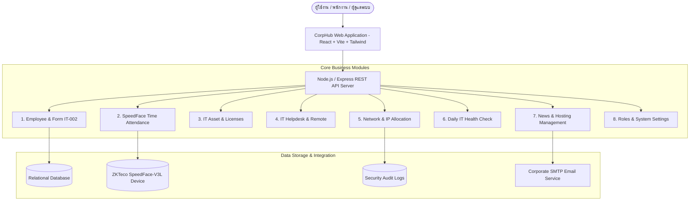
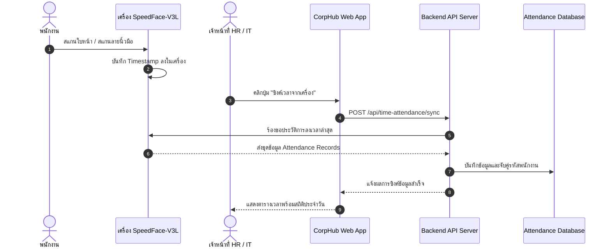
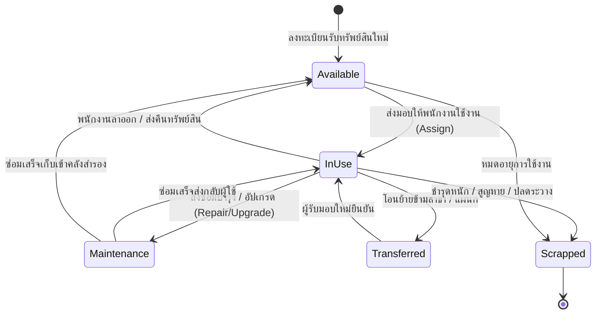
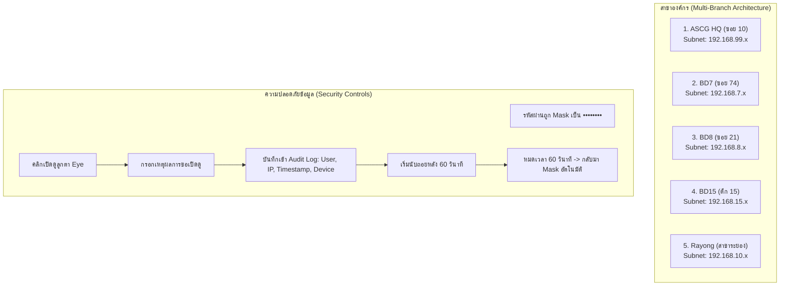
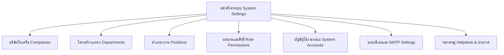

# คู่มือการใช้งานระบบสารสนเทศกลางองค์กร CorpHub
## (CorpHub Enterprise Management Portal - User & Administrator Manual)

---

> **เอกสารควบคุมระดับ:** เอกสารเผยแพร่ภายในองค์กร (Internal Document)  
> **รหัสเอกสาร:** DOC: MNL-CORPHUB-001  
> **เวอร์ชัน:** 2.0 (ปรับปรุงล่าสุด: กันยายน 2026)  
> **ฝ่ายงานที่รับผิดชอบ:** ฝ่ายเทคโนโลยีสารสนเทศและบริการกลาง (IT & Enterprise Operations)  
> **ระบบที่เกี่ยวข้อง:** ระบบบริหารจัดการพนักงาน, ทรัพย์สินไอที, เครือข่าย, การลงเวลา และบริการ Helpdesk  

---

## สารบัญ (Table of Contents)

1. [บทนำและภาพรวมระบบ (Introduction & Architecture)](#1-บทนำและภาพรวมระบบ)
2. [โครงสร้างบทบาทและสิทธิ์การใช้งาน (Roles & Permissions)](#2-โครงสร้างบทบาทและสิทธิ์การใช้งาน)
3. [การเข้าสู่ระบบและการจัดการบัญชี (Login & Account Management)](#3-การเข้าสู่ระบบและการจัดการบัญชี)
4. [หน้าหลักแดชบอร์ด (Dashboard Overview & Executive Summary)](#4-หน้าหลักแดชบอร์ด)
5. [โมดูลที่ 1: ระบบจัดการพนักงาน (Employee Management)](#5-โมดูลที่-1-ระบบจัดการพนักงาน-employee-management)
6. [โมดูลที่ 2: ระบบบันทึกเวลาเข้า-ออกงาน (Time Attendance)](#6-โมดูลที่-2-ระบบบันทึกเวลาเข้า-ออกงาน-time-attendance)
7. [โมดูลที่ 3: ระบบทะเบียนทรัพย์สินไอที (Asset Management)](#7-โมดูลที่-3-ระบบทะเบียนทรัพย์สินไอที-asset-management)
8. [โมดูลที่ 4: ระบบรับแจ้งปัญหาไอที (IT Helpdesk)](#8-โมดูลที่-4-ระบบรับแจ้งปัญหาไอที-it-helpdesk)
9. [โมดูลที่ 5: ระบบจัดการเครือข่ายและไอพี (Network & IP Management)](#9-โมดูลที่-5-ระบบจัดการเครือข่ายและไอพี-network--ip-management)
10. [โมดูลที่ 6: ระบบตรวจเช็คสภาพไอทีประจำวัน (IT Health Check)](#10-โมดูลที่-6-ระบบตรวจเช็คสภาพไอทีประจำวัน-it-health-check)
11. [โมดูลที่ 7: ระบบประกาศข่าวสารและจัดการโฮสติ้ง (Announcements & Hosting)](#11-โมดูลที่-7-ระบบประกาศข่าวสารและจัดการโฮสติ้ง-announcements--hosting)
12. [โมดูลที่ 8: การตั้งค่าระบบและบัญชีผู้ใช้งาน (System Settings & Security)](#12-โมดูลที่-8-การตั้งค่าระบบและบัญชีผู้ใช้งาน-system-settings--security)
13. [ภาคผนวกและการแก้ไขปัญหาเบื้องต้น (Appendix & FAQ)](#13-ภาคผนวกและการแก้ไขปัญหาเบื้องต้น-appendix--faq)

---

## 1. บทนำและภาพรวมระบบ

ระบบ **CorpHub (Enterprise Management Portal)** ได้รับการออกแบบและพัฒนาขึ้นเพื่อเป็นศูนย์กลางการบริหารจัดการงานสารสนเทศและทรัพยากรบุคคลของกลุ่มบริษัทในเครือ (ASCG Group & Affiliates) โดยผสานรวมการทำงานระหว่างฝ่ายบริหารทรัพยากรบุคคล (HR), ฝ่ายเทคโนโลยีสารสนเทศ (IT Support) และพนักงานทั่วไป (Employee) ให้อยู่บนแพลตฟอร์มเดียวกันอย่างเป็นเอกภาพและปลอดภัย



### วัตถุประสงค์หลักของระบบ
1. **Single Source of Truth:** รวมศูนย์ฐานข้อมูลบุคลากร ทรัพย์สินคอมพิวเตอร์ และอุปกรณ์เครือข่ายทุกสาขาเข้าสู่ฐานข้อมูลเดียว
2. **Security & Auditability:** รักษาความปลอดภัยระดับสูงด้วยระบบ Role-Based Access Control (RBAC), การ Mask รหัสผ่าน และการบันทึก Audit Log ทุกครั้งที่มีการเปิดดูข้อมูลสำคัญ
3. **Operational Continuity:** เพิ่มประสิทธิภาพการตรวจสอบระบบรายวัน (Health Check) และการประสานงานแจ้งซ่อม IT อย่างรวดเร็วผ่าน Ticket System
4. **Seamless Onboarding/Offboarding:** รองรับการออกรหัสพนักงานอัตโนมัติ การสร้างฟอร์มมอบหมายทรัพย์สิน IT-FORM-002 และกระบวนการคืนสิทธิ์/ถอดถอนผู้ใช้งานพ้นสภาพ

---

## 2. โครงสร้างบทบาทและสิทธิ์การใช้งาน

ระบบ CorpHub กำหนดโครงสร้างการควบคุมสิทธิ์ตามบทบาท (Role-Based Access Control) ออกเป็น 5 บทบาทหลัก เพื่อความมั่นคงปลอดภัยตามหลักการ Least Privilege

| ลำดับ | บทบาท (Role) | สัญลักษณ์ / สีประจำสิทธิ์ | กลุ่มผู้ใช้งานเป้าหมาย | สิทธิ์การเข้าถึงหลัก |
| :---: | :--- | :---: | :--- | :--- |
| 1 | **Super Admin / Admin** | <span style="color:#b45309;font-weight:bold;">สีส้มทอง (Amber)</span> | ผู้ดูแลระบบสารสนเทศระดับสูง | เข้าถึงได้ทุกโมดูล, จัดการสิทธิ์, ดู Audit Log, ตั้งค่าระบบ |
| 2 | **HR (Human Resources)** | <span style="color:#c2690a;font-weight:bold;">สีส้มอ่อน (Orange)</span> | เจ้าหน้าที่ฝ่ายบริหารทรัพยากรบุคคล | จัดการข้อมูลพนักงาน, บันทึกเวลาเข้า-ออก, เผยแพร่ประกาศ |
| 3 | **IT Support** | <span style="color:#2563eb;font-weight:bold;">สีน้ำเงิน (Indigo/Blue)</span> | เจ้าหน้าที่ฝ่ายบริการเทคโนโลยีสารสนเทศ | จัดการ Helpdesk, ทะเบียนทรัพย์สิน, แผนผัง IP, Health Check |
| 4 | **Manager** | <span style="color:#047857;font-weight:bold;">สีเขียวมรกต (Emerald)</span> | ผู้จัดการ / หัวหน้างานแผนก | ดูแดชบอร์ดภาพรวม, แจ้งปัญหา IT, ติดตามสถานะงาน |
| 5 | **Employee** | <span style="color:#4b5563;font-weight:bold;">สีเทากลาง (Slate)</span> | พนักงานทั่วไปในเครือทุกสังกัด | เข้าหน้าหลัก, แจ้งปัญหา IT, ดูประวัติส่วนตัวและสลิปเงินเดือน |

---

### ตารางเปรียบเทียบสิทธิ์การเข้าถึงเมนูและฟังก์ชัน (Permission Matrix)

| รายการเมนู / ฟังก์ชันงาน | Super Admin | Admin | HR | IT Support | Manager | Employee |
| :--- | :---: | :---: | :---: | :---: | :---: | :---: |
| **หน้าหลักแดชบอร์ด (Dashboard Overview)** | :white_check_mark: | :white_check_mark: | :white_check_mark: | :white_check_mark: | :white_check_mark: | :white_check_mark: |
| **บริการแจ้งปัญหา IT (IT Helpdesk User View)** | :white_check_mark: | :white_check_mark: | :white_check_mark: | :white_check_mark: | :white_check_mark: | :white_check_mark: |
| **โปรไฟล์ส่วนตัว (Personal Profile)** | :white_check_mark: | :white_check_mark: | :white_check_mark: | :white_check_mark: | :white_check_mark: | :white_check_mark: |
| **ทะเบียนพนักงาน (Employee List)** | :white_check_mark: | :white_check_mark: | :white_check_mark: | :heavy_minus_sign: | :heavy_minus_sign: | :heavy_minus_sign: |
| **เพิ่ม/แก้ไขข้อมูลพนักงาน (Add/Edit Employee)** | :white_check_mark: | :white_check_mark: | :white_check_mark: | :heavy_minus_sign: | :heavy_minus_sign: | :heavy_minus_sign: |
| **พิมพ์ใบมอบหมายทรัพย์สิน (Print IT-FORM-002)** | :white_check_mark: | :white_check_mark: | :white_check_mark: | :white_check_mark: | :heavy_minus_sign: | :heavy_minus_sign: |
| **บันทึกเวลาเข้า-ออกงาน (Time Attendance)** | :white_check_mark: | :white_check_mark: | :white_check_mark: | :white_check_mark: | :heavy_minus_sign: | :heavy_minus_sign: |
| **ซิงค์เวลาจากเครื่อง SpeedFace** | :white_check_mark: | :white_check_mark: | :white_check_mark: | :white_check_mark: | :heavy_minus_sign: | :heavy_minus_sign: |
| **จัดการประกาศข่าวสาร (Announcements)** | :white_check_mark: | :white_check_mark: | :white_check_mark: | :heavy_minus_sign: | :heavy_minus_sign: | :heavy_minus_sign: |
| **ระบบรับแจ้งซ่อม IT (Helpdesk Management)** | :white_check_mark: | :white_check_mark: | :heavy_minus_sign: | :white_check_mark: | :heavy_minus_sign: | :heavy_minus_sign: |
| **ทะเบียนทรัพย์สินไอที (Asset Management)** | :white_check_mark: | :white_check_mark: | :heavy_minus_sign: | :white_check_mark: | :heavy_minus_sign: | :heavy_minus_sign: |
| **จัดการเครือข่าย & IP (Network Devices)** | :white_check_mark: | :white_check_mark: | :heavy_minus_sign: | :white_check_mark: | :heavy_minus_sign: | :heavy_minus_sign: |
| **เปิดดูรหัสผ่านเครือข่ายพร้อม Audit Log** | :white_check_mark: | :white_check_mark: | :heavy_minus_sign: | :white_check_mark: | :heavy_minus_sign: | :heavy_minus_sign: |
| **ตรวจเช็คสภาพระบบประจำวัน (IT Health Check)** | :white_check_mark: | :white_check_mark: | :heavy_minus_sign: | :white_check_mark: | :heavy_minus_sign: | :heavy_minus_sign: |
| **จัดการโฮสติ้งและโดเมน (Hosting & Domain)** | :white_check_mark: | :white_check_mark: | :heavy_minus_sign: | :white_check_mark: | :heavy_minus_sign: | :heavy_minus_sign: |
| **จัดการบัญชีผู้ใช้งานระบบ (System Accounts)** | :white_check_mark: | :white_check_mark: | :heavy_minus_sign: | :heavy_minus_sign: | :heavy_minus_sign: | :heavy_minus_sign: |
| **ตั้งค่าระบบทั่วไป (Companies, Roles, SMTP)** | :white_check_mark: | :white_check_mark: | :heavy_minus_sign: | :heavy_minus_sign: | :heavy_minus_sign: | :heavy_minus_sign: |
| **แถบจำลองสิทธิ์ (Role Simulation Bar)** | :white_check_mark: | :white_check_mark: | :heavy_minus_sign: | :heavy_minus_sign: | :heavy_minus_sign: | :heavy_minus_sign: |

---

### ระบบจำลองสิทธิ์การใช้งาน (Role Simulation Tool)
สำหรับผู้ดูแลระบบระดับ Admin เท่านั้น บริเวณแถบเมนูด้านบน (Top Navbar) จะมีปุ่ม **"จำลองสิทธิ์"** เพื่อสลับมุมมองหน้าจอระหว่าง Admin, HR, IT Support โดยไม่ต้องออกจากระบบจริง:
1. คลิกปุ่มบทบาทที่ต้องการทดสอบ เช่น `HR` หรือ `IT Support`
2. ระบบจะทำการปรับสิทธิ์ในเครื่องและนำไปยังหน้าแดชบอร์ดตามสิทธิ์นั้นๆ โดยอัตโนมัติ
3. เมื่อต้องการคืนค่าสิทธิ์ผู้ดูแลระบบเดิม ให้คลิกปุ่ม **"✕ คืนค่า" (Reset Role)** สีแดงด้านขวา

---

## 3. การเข้าสู่ระบบและการจัดการบัญชี

### 3.1 ขั้นตอนการเข้าสู่ระบบ (Login)
1. เปิดเว็บบราวเซอร์ (Google Chrome, Microsoft Edge หรือ Safari) เข้าสู่ URL ระบบ
2. ที่หน้าลงชื่อเข้าใช้ ให้ระบุข้อมูล:
   - **อีเมลองค์กร / ชื่อผู้ใช้ (Username):** สามารถกรอกอีเมลบริษัท เช่น `somchai.s@ascggroup.com` หรือชื่อผู้ใช้ `admin` หรือรหัสพนักงาน `CORP001`
   - **รหัสผ่าน (Password):** รหัสผ่านประจำตัว
   - **จดจำการเข้าสู่ระบบบนอุปกรณ์นี้ (Remember Me):** ติ๊กเครื่องหมายถูก หากเป็นเครื่องคอมพิวเตอร์ส่วนบุคคลประจำตำแหน่ง (ระบบจะจดจำเซสชันนาน 30 วัน)
3. คลิกปุ่ม **"เข้าสู่ระบบ" (Login)**

> [!NOTE]
> หากเข้าใช้งานจากคอมพิวเตอร์สาธารณะ ห้ามเลือกช่อง "จดจำการเข้าสู่ระบบ" และควรกดปุ่ม **"ออกจากระบบ"** ทุกครั้งหลังเสร็จสิ้นการใช้งาน

```
[หน้าเข้าสู่ระบบ]
 ┌────────────────────────────────────────────────────────┐
 │                      CorpHub                           │
 │             ENTERPRISE MANAGEMENT PORTAL               │
 │                                                        │
 │  อีเมลองค์กร / ชื่อผู้ใช้: [ somchai.s@ascggroup.com ]  │
 │  รหัสผ่าน:                [ ••••••••••••             ] │
 │  [✓] จดจำการเข้าสู่ระบบบนอุปกรณ์นี้                     │
 │                                                        │
 │               [    เข้าสู่ระบบ (Login)    ]            │
 │                                                        │
 │ ────────────── หรือ (Public Services) ──────────────── │
 │           [ ← กลับหน้าข่าวสารองค์กร ]                  │
 └────────────────────────────────────────────────────────┘
```

### 3.2 การเปลี่ยนธีมแสดงผล (Dark Mode / Light Mode)
ผู้ใช้งานสามารถคลิกที่ไอคอนรูป **ดวงอาทิตย์ (Sun) / พระจันทร์ (Moon)** บนแถบด้านบนขวา เพื่อสลับโหมดการแสดงผลแบบสบายตาในเวลากลางคืน (Dark Mode) หรือโหมดทำงานปกติ (Light Mode)

### 3.3 การออกจากระบบ (Logout)
คลิกที่ปุ่ม **"ออกจากระบบ"** ที่มุมขวาบนของแถบเครื่องมือ ระบบจะทำการเคลียร์ความปลอดภัยของ Token และนำผู้ใช้งานกลับสู่หน้าเข้าสู่ระบบ

---

## 4. หน้าหลักแดชบอร์ด

หน้าแดชบอร์ดจะปรับเปลี่ยนการแสดงผลตามบทบาทของผู้ใช้งานที่เข้าสู่ระบบโดยอัตโนมัติ:

### 4.1 แดชบอร์ดพนักงานทั่วไป (Employee Dashboard)
- **การทักทายประจำตัว:** แสดงชื่อเล่น/ชื่อจริงของผู้ใช้งาน
- **การ์ดทางลัด (Quick Action Cards):**
  - **แจ้งปัญหา IT:** ส่งคำร้องขอความช่วยเหลือไปยังทีม IT
  - **สลิปเงินเดือน (Payslip):** ตรวจสอบสลิปเงินเดือน
  - **ข้อมูลส่วนตัว (Profile):** ตรวจสอบประวัติการทำงาน ข้อมูลสังกัด และทรัพย์สินคอมพิวเตอร์ที่ถือครอง

### 4.2 แดชบอร์ดฝ่ายทรัพยากรบุคคล (HR Dashboard)
- **สรุปสถิติจำนวนพนักงานประจำเดือน:**
  - จำนวนพนักงานที่มีสถานะทำงานอยู่ (Active Employees)
  - พนักงานใหม่ประจำเดือนปัจจุบัน (New Hires This Month)
  - พนักงานที่พ้นสภาพ (Resigned/Inactive Employees)
- **ประวัติกิจกรรมล่าสุด (Recent Activities):** การเพิ่มพนักงานใหม่ และประวัติการเปลี่ยนแปลงสิทธิ์

### 4.3 แดชบอร์ดผู้ดูแลระบบและฝ่ายไอที (Admin & IT Support Dashboard)
- **ตัวเลขสถิติระบบแบบภาพรวม:**
  - จำนวนพนักงานที่ทำงานอยู่ทั้งหมด
  - จำนวนทิกเก็ตแจ้งซ่อม IT ที่ค้างอยู่และรอรับเรื่อง (Pending Tickets)
- **วิดเจ็ตสรุปภาพรวมผู้บริหารแบบ Real-Time (Executive Operations Summary Widget):**
  - **สรุปจำนวนเครื่องคอมพิวเตอร์ (PC / Notebook):** คำนวณแยกตามบริษัทในเครือ พร้อมลิงก์ด่วนเพื่อดูรายการทรัพย์สินของแต่ละบริษัทได้ทันที
  - **ประวัติการปรับปรุงระบบ Network & Firewall:** บันทึกการเปลี่ยนแปลงสำคัญของสาขา เช่น การอัปเกรด FortiGate 70G
- **กระดิ่งแจ้งเตือนอัจฉริยะ (Interactive Notifications Bar):**
  - แสดงจำนวนรายการที่ต้องดำเนินการ (Action Items)
  - แจ้งเตือนพนักงานใหม่ที่รอสร้างสิทธิ์การเข้าใช้งาน
  - แจ้งเตือนพนักงานพ้นสภาพที่ต้องทำการถอดสิทธิ์และเรียกคืนทรัพย์สิน
  - แจ้งเตือนใบงานแจ้งซ่อม IT ที่ยังไม่ได้รับเรื่อง
  - แจ้งเตือนโดเมนและโฮสติ้งที่ใกล้หมดอายุในระยะ 30 วัน

---

## 5. โมดูลที่ 1: ระบบจัดการพนักงาน (Employee Management)

โมดูลนี้รองรับกระบวนการ Onboarding, เก็บประวัติครอบคลุม 5 หมวดหมู่, พิมพ์เอกสาร IT-FORM-002 จนกระทั่งการทำ Offboarding เมื่อพ้นสภาพ

### 5.1 การคำนวณและสร้างรหัสพนักงานอัตโนมัติ (Auto-Generate Employee Code)
เมื่อผู้ดูแลระบบหรือฝ่ายบุคคลเลือก **สังกัดบริษัท (Company Prefix)** ในหน้าเพิ่มพนักงานใหม่ ระบบจะทำการสืบค้นรหัสพนักงานล่าสุดของบริษัทนั้นๆ ในฐานข้อมูล และสร้างรหัสถัดไปให้โดยอัตโนมัติ เช่น:
- สังกัด `CORP` -> `CORP001`, `CORP002`, ...
- สังกัด `TECH` -> `TECH001`, `TECH002`, ...
- สังกัด `INNO` -> `INNO001`, `INNO002`, ...

### 5.2 การสร้างอีเมลและรหัสผ่านเริ่มต้นอัตโนมัติ (Auto Email & Password)
- **อีเมล:** เมื่อกรอกชื่อและนามสกุลภาษาอังกฤษ ระบบจะสร้างอีเมลรูปแบบ `firstname.initial@companydomain.com` ให้อัตโนมัติ (สามารถแก้ไขเพิ่มเติมได้)
- **รหัสผ่านเริ่มต้น:** สร้างในรูปแบบมาตรฐาน `P@ssw0rd[อักษรแรกชื่อ][อักษรแรกนามสกุล]` เช่น สมชาย สุขใจ (`Somchai Sukjai`) -> `P@ssw0rdSS`

---

### 5.3 ข้อมูลประวัติพนักงาน 5 หมวดหมู่ (Tab Breakdown)


1. **หมวดที่ 1: ข้อมูลส่วนบุคคล (Personal Information):**
   - คำนำหน้า, ชื่อ-นามสกุล (ภาษาไทยและอังกฤษ), ชื่อเล่น
   - วัน/เดือน/ปีเกิด, ระบบคำนวณอายุอัตโนมัติ (Auto-calculated Age)
   - เลขบัตรประจำตัวประชาชน, กรุ๊ปเลือด, ศาสนา, สถานภาพสมรส, สถานะการเกณฑ์ทหาร
   - เบอร์โทรศัพท์มือถือ, อีเมลส่วนตัว, ที่อยู่ตามทะเบียนบ้านและที่อยู่ปัจจุบัน
2. **หมวดที่ 2: ประวัติการศึกษาและการทำงาน (Education & Experience):**
   - ประวัติการศึกษาสูงสุด: สถาบันการศึกษา, วุฒิการศึกษา, สาขาวิชา, เกรดเฉลี่ย (GPA)
   - ประวัติการทำงานเดิม: ชื่อสถานที่ทำงาน, ตำแหน่งงาน, เงินเดือนล่าสุด, ระยะเวลาทำงาน, เหตุผลที่ลาออก
3. **หมวดที่ 3: ข้อมูลครอบครัว (Family Details):**
   - ข้อมูลบิดา-มารดา: ชื่อ-นามสกุล, อาชีพ, เบอร์ติดต่อ, สถานะการมีชีวิต
   - ข้อมูลคู่สมรสและบุตร
   - ผู้ติดต่อกรณีฉุกเฉิน (Emergency Contact): ชื่อผู้ติดต่อ, ความสัมพันธ์, เบอร์โทรศัพท์
4. **หมวดที่ 4: ทักษะและความสามารถ (Skills & Abilities):**
   - ทักษะภาษาต่างประเทศ (ภาษาอังกฤษ, จีน, ญี่ปุ่น ฯลฯ) ระดับการฟัง/พูด/อ่าน/เขียน
   - ทักษะทางคอมพิวเตอร์และโปรแกรมเฉพาะทาง
   - ใบอนุญาตขับขี่ (รถยนต์ / รถจักรยานยนต์)
5. **หมวดที่ 5: เอกสารอ้างอิงและข้อมูลอื่นๆ (Others & References):**
   - แหล่งที่มาในการสมัครงาน, บุคคลอ้างอิง (References)
   - ประวัติสุขภาพ โรคประจำตัว หรือประวัติการเจ็บป่วย

---

### 5.4 การพิมพ์ใบมอบหมายทรัพย์สินและสิทธิ์ไอที (IT-FORM-002)
เอกสาร IT-FORM-002 เป็นเอกสารสำคัญทางนิติกรรมภายในเพื่อส่งมอบอุปกรณ์ไอทีและบัญชีเข้าใช้งานให้กับพนักงานใหม่

**ขั้นตอนการสั่งพิมพ์:**
1. ไปที่เมนู **"รายการผู้ใช้งานระบบ" (Employee List)**
2. ค้นหารายชื่อพนักงานที่ต้องการ
3. คลิกที่ไอคอน **รูปเครื่องพิมพ์ (Printer)** ในคอลัมน์จัดการ
4. ระบบจะเปิดหน้าตัวอย่างก่อนพิมพ์ (Print Preview) ขนาดมาตรฐาน A4 โดยมีรายละเอียด:
   - ตราสัญลักษณ์และชื่อบริษัทตามสังกัด
   - รหัสพนักงาน, ชื่อภาษาไทยและภาษาอังกฤษ, ตำแหน่ง, แผนก
   - ข้อมูลบัญชี Login Domain, Email, รหัสผ่านเริ่มต้น
   - คำอ่านออกเสียงภาษาไทยสำหรับรหัสผ่าน (Phonetic Password) เช่น `พีใหญ่ แอดไซต์ เอสเล็ก...` เพื่อป้องกันความสับสนในการพิมพ์
   - ตารางทรัพย์สินคอมพิวเตอร์ที่ได้รับมอบหมาย (Serial Number, Model, Specifications)
   - ข้อกำหนดความปลอดภัยและการลงนามรับทราบของผู้ถือครองและเจ้าหน้าที่ไอที
5. สั่งพิมพ์ออกเครื่องพิมพ์หรือบันทึกเป็นไฟล์ PDF

---

### 5.5 ขั้นตอนการทำ IT Offboarding เมื่อพนักงานพ้นสภาพ
เมื่อพนักงานลาออกหรือพ้นสภาพการเป็นพนักงาน:
1. คลิกเปิดกระดิ่งแจ้งเตือน หรือไปที่หน้าจัดการพนักงาน
2. เลือกฟังก์ชัน **"ถอดสิทธิ์และบันทึกพ้นสภาพ" (Offboard Checklist)**
3. ตรวจสอบและระบุรายการ:
   - **วันที่มีผลพ้นสภาพ (Resignation Date)**
   - **ทรัพย์สินที่ต้องส่งคืน (Return Assets):** ติ๊กเลือกรายการอุปกรณ์ที่ส่งคืนคลัง IT
   - **สถานที่จัดเก็บทรัพย์สิน:** เช่น คลัง IT ส่วนกลาง สำนักงานใหญ่
   - **การระงับสิทธิ์การใช้งาน:** ติ๊กเลือกตัดสิทธิ์เข้าระบบ CorpHub, อีเมลบริษัท, VPN และ Shared Drive (NAS)
4. บันทึกหมายเหตุการส่งมอบงาน แล้วกดยืนยัน ระบบจะปรับสถานะพนักงานเป็น **Resigned** และนำทรัพย์สินกลับเข้าสู่สถานะ **Available** ในทะเบียนทรัพย์สินทันที

---

## 6. โมดูลที่ 2: ระบบบันทึกเวลาเข้า-ออกงาน (Time Attendance)

ระบบเชื่อมต่อตรงกับเครื่องสแกนใบหน้าและลายนิ้วมือ **ZKTeco SpeedFace-V3L** ผ่านโปรโตคอลเครือข่ายภายในองค์กร



### 6.1 ขั้นตอนการซิงค์เวลาจากเครื่องสแกน
1. เข้าเมนู **"บันทึกเวลาเข้า-ออกงาน" (Time Attendance)**
2. สังเกตสถานะการเชื่อมต่อของเครื่องสแกนที่มุมบนซ้าย (แสดงสถานะออนไลน์, จำนวนรายการบันทึก และเวลาที่ซิงค์ล่าสุด)
3. คลิกปุ่ม **"ซิงค์เวลาจากเครื่อง" (Sync Attendance Logs)**
4. ระบบจะทำการดึงประวัติการสแกนใหม่จากตัวเครื่อง SpeedFace เข้าสู่ฐานข้อมูล และแจ้งจำนวนรายการที่ได้รับการปรับปรุง

### 6.2 การสืบค้นและคัดกรองข้อมูลเวลา
- **ช่วงเวลาด่วน (Quick Presets):** คลิกเลือก `วันนี้`, `7 วันล่าสุด`, `เดือนนี้` หรือ `ทั้งหมด`
- **ค้นหาตามรายชื่อ/รหัสพนักงาน:** พิมพ์รหัสพนักงาน ชื่อ หรือแผนกลงในช่องค้นหา
- **ประเภทการสแกน:** คัดกรองเฉพาะ `CheckIn` (เข้างาน) หรือ `CheckOut` (ออกงาน)

### 6.3 การจัดการผู้ใช้บนตัวเครื่องสแกน (Device Users)
- คลิกปุ่ม **"จัดการผู้ใช้บนเครื่อง"** เพื่อตรวจสอบรายชื่อพนักงานที่มีลายนิ้วมือ/ใบหน้าถูกบันทึกอยู่ในตัวเครื่อง SpeedFace
- ตรวจสอบความถูกต้องว่า User ID บนเครื่องตรงกับรหัสพนักงานในระบบ
- มีปุ่มสำหรับลบผู้ใช้ออกจากตัวเครื่องสแกนกรณีพนักงานพ้นสภาพ

### 6.4 การส่งออกข้อมูลเป็น CSV (Export CSV)
คลิกปุ่ม **"Export CSV"** เพื่อดาวน์โหลดรายงานบันทึกเวลาเข้า-ออก สำหรับนำไปประมวลผลต่อในระบบ Payroll หรือจัดทำรายงานการมาทำงานของพนักงาน

---

## 7. โมดูลที่ 3: ระบบทะเบียนทรัพย์สินไอที (Asset Management)

ใช้สำหรับควบคุมวงจรชีวิตทรัพย์สิน (Asset Lifecycle Management) ครอบคลุมตั้งแต่การจัดซื้อ การส่งมอบ การโอนย้าย การซ่อมบำรุง จนกระทั่งปลดระวาง



### 7.1 การลงทะเบียนทรัพย์สินใหม่ (Add IT Asset)
1. เข้าสู่เมนู **"ทะเบียนทรัพย์สิน" (Asset Management)** แล้วคลิก **"+ เพิ่มทรัพย์สินใหม่"**
2. ระบุข้อมูลสำคัญ:
   - **รหัสทรัพย์สิน (Asset Code):** ระบบตั้งค่าอัตโนมัติตามรูปแบบสังกัดและหมวดหมู่ เช่น `AIC-PC-025`
   - **หมวดหมู่ (Category):** PC, Notebook, Monitor, Server, Network, Printer, UPS ฯลฯ
   - **บริษัทเจ้าของและสถานที่จัดเก็บ:** เลือกบริษัทสังกัด และสถานที่ตั้ง (เช่น HQ ซอย 10, BD-7, BD-8, ตึก 15, ระยอง)
   - **ข้อมูลเครื่อง:** ยี่ห้อ (Brand), รุ่น (Model), หมายเลขเครื่อง (Serial Number)
   - **สเปกเครื่อง (Specifications):** CPU, RAM, Storage (SSD/HDD), ขนาดจอภาพ (Display Size)
   - **ซอฟต์แวร์และลิขสิทธิ์ (Software Licenses):** Windows OS Name & Key, Microsoft Office Name & Key
   - **ข้อมูลจัดซื้อ:** วันที่ซื้อ, ราคา (Price), เลขที่ใบสั่งซื้อ (PO Number), ระยะเวลารับประกัน
   - **รูปภาพทรัพย์สิน:** สามารถแนบรูปถ่ายตัวเครื่องเพื่อความถูกต้องในการตรวจสอบ
3. คลิก **"บันทึกข้อมูล"**

### 7.2 การผูกทรัพย์สินกับผู้ใช้งาน (Assign Asset)
- ในตารางทรัพย์สิน ให้คลิกปุ่ม **"แก้ไข"** หรือ **"ส่งมอบ"**
- เลือกชื่อพนักงานที่ต้องการมอบหมายอุปกรณ์
- สถานะของทรัพย์สินจะเปลี่ยนจาก `Available (ว่าง)` เป็น `In-Use (กำลังใช้งาน)` โดยอัตโนมัติ

### 7.3 การบันทึกประวัติการซ่อมบำรุง (Maintenance Record)
- คลิกที่ไอคอน **รูปประแจ (Wrench)** ที่แถวทรัพย์สินนั้นๆ
- ระบุประเภท: `ซ่อมแซม (Repair)`, `อัปเกรด (Upgrade)` หรือ `ตรวจเช็คตามระยะ (Preventive Maintenance)`
- กรอกรายละเอียดงานซ่อม เช่น เปลี่ยนพัดลม CPU, เพิ่ม RAM จาก 8GB เป็น 16GB, ค่าใช้จ่ายในการซ่อม, ชื่อช่าง/ศูนย์บริการ
- หากเครื่องต้องส่งซ่อมภายนอก ให้เปลี่ยนสถานะเป็น `Maintenance` จนกว่าจะส่งกลับคืน

### 7.4 การโอนย้ายทรัพย์สิน (Asset Transfer & Loan)
- คลิกที่ไอคอน **โอนย้าย (ArrowRightLeft)**
- **โอนย้ายถาวร (Transfer):** ระบุบริษัทปลายทาง แผนก สถานที่ และผู้ครอบครองคนใหม่
- **ยืมใช้งานชั่วคราว (Loan):** ระบุวัตถุประสงค์การยืม และกำหนดวันส่งคืน (Return Due Date)
- ระบบจะบันทึกประวัติเส้นทางการโอนย้าย (Transfer Audit Trail) เก็บไว้เป็นประวัติในรายละเอียดทรัพย์สิน

### 7.5 การส่งออกทะเบียนทรัพย์สินเป็น Excel (Export Excel)
คลิกปุ่ม **"Export Excel"** ด้านบนขวา ระบบจะสร้างไฟล์รายงาน `.xlsx` สมบูรณ์แบบด้วย ExcelJS พร้อมสรุปรายละเอียดสเปกและผู้ถือครองทั้งหมด

---

## 8. โมดูลที่ 4: ระบบรับแจ้งปัญหาไอที (IT Helpdesk)

ระบบรองรับการแจ้งปัญหาทั้งแบบพนักงานภายในระบบ และบุคคลภายนอก/สาธารณะที่ไม่สะดวกเข้าสู่ระบบ

### 8.1 การแจ้งปัญหาไอที 2 ช่องทาง
1. **การแจ้งซ่อมแบบสาธารณะไม่ต้องเข้าสู่ระบบ (Public Helpdesk - URL: `/report-it`):**
   - เหมาะสำหรับผู้ใช้งานที่ยังไม่มีบัญชีระบบ ลืมรหัสผ่าน หรือเครื่องคอมพิวเตอร์เปิดเข้าใช้งานไม่ได้
   - เข้าผ่านปุ่มลิงก์หน้าแรกของเว็บไซต์ กรอกชื่อผู้ติดต่อ, แผนก, เลือกหมวดหมู่ปัญหา, ระดับความเร่งด่วน และคำอธิบายปัญหา
2. **การแจ้งซ่อมผ่านระบบภายใน (Internal Helpdesk - URL: `/it-support`):**
   - เข้าสู่ระบบแล้วเลือกเมนู "แจ้งปัญหา IT"
   - ระบบจะดึงข้อมูลชื่อและสังกัดของผู้ใช้งานให้อัตโนมัติ

> [!TIP]
> **โปรแกรมรีโมทช่วยเหลือระยะไกล (AnyDesk Integration):**  
> ในหน้าแจ้งซ่อมจะมีกล่องดาวน์โหลดโปรแกรม **AnyDesk สำหรับ Windows** เมื่อผู้ใช้เปิดโปรแกรม ให้แจ้งหมายเลข AnyDesk Address (9 หลัก) ไว้ในช่องรายละเอียดปัญหา เพื่อให้เจ้าหน้าที่ไอทีสามารถรีโมทเข้ามาตรวจเช็คเครื่องได้ทันที

```
[ขั้นตอนการแจ้งซ่อม IT]
1. เข้าเมนูแจ้งปัญหา IT
2. เลือกหมวดหมู่งาน: Hardware / Software / Network / Email / Printer
3. เลือกระดับความเร่งด่วน: ต่ำ / ปานกลาง / สูง / ด่วนฉุกเฉิน
4. กรอกรายละเอียดปัญหา + รหัส AnyDesk (ถ้ามี)
5. กดยืนยัน -> รับรหัสอ้างอิงทิกเก็ต เช่น TCK-20260904-001
```

### 8.2 การบริหารจัดการและอัปเดตงานแจ้งซ่อมสำหรับเจ้าหน้าที่ IT
1. เจ้าหน้าที่ไอทีเข้าเมนู **"ระบบรับแจ้งซ่อม IT" (`/admin/it-support`)**
2. คัดกรองรายการทิกเก็ตตามสถานะ:
   - `รอรับเรื่อง` (สีส้ม)
   - `กำลังดำเนินการ` (สีน้ำเงิน)
   - `แก้ไขเสร็จสิ้น` (สีเขียว)
   - `ยกเลิกรายการ` (สีแดง)
3. คลิกปุ่ม **"จัดการงาน"** ในทิกเก็ตที่ต้องการ:
   - เปลี่ยนสถานะงาน
   - มอบหมายเจ้าหน้าที่ผู้รับผิดชอบงาน (Assigned To)
   - บันทึกแนวทางแก้ไขและสาเหตุของปัญหา (Root Cause & Resolution Notes)
4. คลิกบันทึก ระบบจะส่งการอัปเดตสถานะไปยังผู้แจ้งซ่อม

---

## 9. โมดูลที่ 5: ระบบจัดการเครือข่ายและไอพี (Network & IP Management)

ศูนย์กลางการควบคุมผังเครือข่ายองค์กร ตรวจสอบหมายเลข IP ของอุปกรณ์ทุกสาขา และระบบความปลอดภัยขั้นสูงในการเข้าถึงรหัสผ่าน



### 9.1 ผัง IP Address แยกตามสาขา (Branch Breakdown)
ผู้ดูแลระบบสามารถเลือกแถบสาขาเพื่อดูอุปกรณ์และ Subnet ที่เกี่ยวข้อง:
- **ซอย 10 (ASCG Head Office):** DC Server, ShareFile Server, CCTV 32CH, Access Point, Core Firewall FGT-60E
- **ซอย 74 (BD7):** iDRAC Server, Backup Router, Network Gateway
- **ซอย 21 (BD8):** AIS WAN Router, CCTV, เครื่องลงเวลา
- **ตึก 15 (BD15):** Time Attendance, CCTV 8CH, Network Switch
- **สาขาระยอง (Rayong):** DDNS Routers, CCTV Storage, Access Control

### 9.2 ระบบป้องกันและแจ้งเตือน IP ชนกัน (IP Collision Check)
เมื่อเจ้าหน้าที่ทำการเพิ่มอุปกรณ์ใหม่หรือแก้ไขอุปกรณ์เดิม ระบบจะทำการตรวจสอบหมายเลข IP กับฐานข้อมูลอุปกรณ์ทั้งหมด หากพบว่าหมายเลข IP ดังกล่าวถูกกำหนดให้อุปกรณ์อื่นไปแล้ว ระบบจะปฏิเสธการบันทึกพร้อมแสดงข้อความแจ้งเตือนทันที:
> **"ข้อผิดพลาด: IP Address 192.168.99.1 ถูกใช้งานแล้วโดยอุปกรณ์ 'DC Server / DNS' กรุณาระบุ IP อื่น"**

---

### 9.3 ระบบความปลอดภัยการเปิดดูรหัสผ่านและการนับถอยหลัง 60 วินาที
เพื่อป้องกันการมองผ่านหน้าจอ (Shoulder Surfing) และควบคุมการเข้าถึงรหัสผ่านสำคัญของอุปกรณ์เครือข่าย:
1. ค่าเริ่มต้นของรหัสผ่าน `Login Password` และ `Access Key / Wi-Fi Key` จะถูกเข้ารหัสและแสดงเป็นจุดทึบ `••••••••`
2. เมื่อเจ้าหน้าที่ต้องการดูรหัสผ่านจริง ให้คลิกไอคอน **รูปดวงตา (Eye)**
3. ระบบจะแสดงหน้าต่างถาม **"เหตุผลในการขอเปิดดูรหัสผ่าน"**
4. เมื่อกดยืนยัน:
   - ตัวเลขรหัสผ่านจริงจะแสดงขึ้นมา
   - **ตัวนับถอยหลัง 60 วินาที (60-Second Countdown Timer)** จะเริ่มทำงานบนหน้าจอ
   - เมื่อครบ 60 วินาที ระบบจะทำการ **Mask รหัสผ่านกลับเป็น •••••••• โดยอัตโนมัติ**

### 9.4 ระบบบันทึกประวัติการเข้าถึงรหัสผ่าน (Audit Log)
ทุกครั้งที่มีการเปิดดูรหัสผ่าน ระบบจะบันทึกลงในฐานข้อมูลความปลอดภัย `audit_logs` โดยไม่สามารถลบหรือแก้ไขได้ ซึ่งบันทึกข้อมูลดังต่อไปนี้:
- **วัน-เวลาที่เรียกดู (Timestamp)**
- **ชื่อผู้ใช้งานและบทบาท (User Name & Role)**
- **หมายเลข IP เครื่องที่คลิกดู (Client IP Address)**
- **อุปกรณ์ที่ถูกเรียกดู (Device Name & Device IP)**
- **เหตุผลที่ระบุในการเปิดดู (Access Reason)**

ผู้ดูแลระบบสามารถคลิกปุ่ม **"ประวัติการเปิดดูรหัสผ่าน (Audit Logs)"** เพื่อตรวจสอบย้อนหลังได้ตลอดเวลา

---

## 10. โมดูลที่ 6: ระบบตรวจเช็คสภาพไอทีประจำวัน (IT Health Check)

เครื่องมือสำหรับเจ้าหน้าที่ไอทีในการเดินตรวจเช็คระบบความพร้อม (Daily Preventive Maintenance) ในทุกๆ เช้า เพื่อให้มั่นใจว่าระบบโครงสร้างพื้นฐานพร้อมรองรับการทำงานของพนักงานทั้งองค์กร

### 10.1 เกณฑ์การประเมินสถานะระบบ
เจ้าหน้าที่จะทำการตรวจเช็คและระบุสถานะของแต่ละรายการตรวจตามมาตรฐาน:
- **[ N ] Normal (ปกติ - สีเขียว):** ระบบทำงานสมบูรณ์ ลิงก์เสถียร เชื่อมต่อได้ตามปกติ
- **[ W ] Warning (เฝ้าระวัง - สีส้ม):** ระบบทำงานได้แต่มีสัญญาณเตือน เช่น อุณหภูมิห้องเซิร์ฟเวอร์สูงกว่าปกติ, ความจุฮาร์ดดิสก์ใกล้เต็ม 85%
- **[ F ] Fault (ขัดข้อง - สีแดง):** อุปกรณ์หยุดทำงาน ลิงก์ขาดการเชื่อมต่อ หรือระบบ Down ต้องเข้าแก้ไขฉุกเฉิน

---

### 10.2 รายการหัวข้อการตรวจเช็คมาตรฐานแยกตามสาขา (Checklist Templates)

| สาขา | หมวดหมู่ | หัวข้อที่ต้องตรวจเช็ค (Item Name & Subject) | สถานะปกติ |
| :--- | :--- | :--- | :---: |
| **ซอย 10 (HQ)** | Internet | TOT 500/1000 Mbps - Link Status & Speedtest | N |
| | Firewall | FortiGate 60E - Rule & Policy Status | N |
| | Firewall | VPN Tunnel เชื่อมต่อไปยัง BD-7 (FGT-90D) | N |
| | Server | ASCG-DC01 (Domain Controller) - Active | N |
| | Server | SHAREFILE (Sharefile / ExpressA) - Ready | N |
| | VOIP | ตู้สาขาโทรศัพท์และระบบเสียงผ่าน IP | N |
| **ซอย 74 (BD7)** | Internet | AIS 1000/1000 Mbps FixIP - Link Status | N |
| | Internet | True 1000/1000 Mbps - Backup Link | N |
| | Telephone | NT Fiber Telephone Status | N |
| | Firewall | FortiGate 60F - VPN to Soi-10 Status | N |
| **ซอย 21 (BD8)** | Internet | AIS 1000/1000 Mbps - WAN IP Status | N |
| | CCTV | กล้องวงจรปิด CH1-16 Monitor & Record | N |
| | Time/Access | เครื่องสแกนบันทึกเวลาเข้า-ออกงาน | N |
| **ตึก 15 (BD15)** | Internet / CCTV | ลิงก์อินเทอร์เน็ต และกล้องวงจรปิด CH1-8 | N |
| **สาขาระยอง** | Internet / DDNS | ลิงก์ AIS (W7) และ NT (W16) DDNS Connection | N |

### 10.3 ขั้นตอนการบันทึกผลการตรวจเช็ค
1. เข้าเมนู **"สถานะระบบ IT (Health Check)"**
2. เลือกวันที่และสาขาที่ต้องการบันทึก
3. คลิกปุ่ม **"+ บันทึกการตรวจเช็ค"**
4. ระบบจะโหลดเทมเพลตมาตรฐานของสาขานั้นขึ้นมา ให้ทำการตรวจสอบและเลือกสถานะ (N/W/F) พร้อมกรอกหมายเหตุ
5. ตรวจสอบชื่อผู้รายงาน (Reporter) และคลิก **"บันทึกผลการตรวจเช็ค"**

### 10.4 การส่งออกรายงานผลการตรวจเช็คเป็น Excel (Export Excel)
1. ระบุช่วงวันที่ต้องการ เช่น จากวันที่ `01/08/2026` ถึง `31/08/2026`
2. คลิกปุ่ม **"Export Excel รายงานตรวจเช็ค"**
3. ระบบจะจัดทำไฟล์ Excel รายงานสรุปสถานะรายวันพร้อมกราฟิกสีสถานะ เพื่อนำเสนอต่อผู้บริหาร

---

## 11. โมดูลที่ 7: ระบบประกาศข่าวสารและจัดการโฮสติ้ง (Announcements & Hosting)

### 11.1 ระบบประกาศข่าวสารองค์กร (Corporate Announcements)
1. **การสร้างประกาศใหม่:**
   - เข้าเมนู **"จัดการประกาศ" (`/admin/announcements`)** คลิก **"+ สร้างประกาศใหม่"**
   - กรอกหัวข้อข่าว, ประเภทข่าวสาร (ข่าวสารทั่วไป, นโยบาย, กิจกรรม, ประกาศด่วน), และเนื้อหาข่าว
   - อัปโหลดรูปภาพหน้าปก (Cover Image) และแนบไฟล์เอกสาร PDF
   - กำหนดสถานะแสดงผล `Active` หรือ `Draft`
2. **การกระจายข่าวสารผ่านอีเมล (Email Broadcast Modal):**
   - ในตารางประกาศ คลิกที่ไอคอน **รูปจดหมาย (Mail)** ที่ข่าวที่ต้องการส่ง
   - เลือกว่าจะส่งในนาม **ฝ่ายบุคคล (HR)** หรือ **ฝ่ายไอที (IT)**
   - เลือกกลุ่มผู้รับ BCC เช่น `All Employees`, `Management Team`, `Branch Staff`
   - กดยืนยัน ระบบจะส่งอีเมลกระจายข่าวสารไปยังกล่องข้อความของพนักงานทันทีผ่านระบบ SMTP

---

### 11.2 ระบบจัดการโฮสติ้งและโดเมน (Hosting & Domain Management)
1. **การบันทึกข้อมูลโฮสติ้ง:**
   - บันทึกชื่อโดเมน (Domain Name), URL เว็บไซต์, ผู้ให้บริการโฮสติ้ง
   - จัดเก็บข้อมูลบัญชีผู้ดูแลระบบ (Username/Password สำหรับ Website และ Email Server) โดยมีปุ่มซ่อน/แสดงรหัสผ่าน
   - ระบุวันที่จดทะเบียน (Registration Date) และวันที่หมดอายุ (Expiration Date)
2. **ระบบแจ้งเตือนการหมดอายุล่วงหน้า (30-Day Expiration Alert):**
   - โดเมนที่เหลือเวลาใช้งานน้อยกว่า 30 วัน จะแสดงแถบสถานะสีส้ม **"ใกล้หมดอายุ"**
   - โดเมนที่เลยกำหนดจะแสดงแถบสีแดง **"หมดอายุแล้ว"**
   - รายการเหล่านี้จะถูกดึงไปแสดงในกระดิ่งแจ้งเตือนบน Top Bar ของ Admin โดยอัตโนมัติ เพื่อป้องกันปัญหาเว็บไซต์ดับหรือโดเมนหลุดการครอบครอง

---

## 12. โมดูลที่ 8: การตั้งค่าระบบและบัญชีผู้ใช้งาน (System Settings & Security)

หน้าจอสำหรับการตั้งค่าโครงสร้างข้อมูลพื้นฐาน (Master Data) และความมั่นคงปลอดภัยสารสนเทศขององค์กร



### 12.1 บริษัทในเครือ แผนก และตำแหน่งงาน (Organization Master Data)
- **บริษัทในเครือ (Affiliate Companies):** กำหนด Prefix, ชื่อภาษาไทย, ชื่อภาษาอังกฤษ และโดเมนอีเมลของแต่ละบริษัท
- **แผนก (Departments):** จัดการรายชื่อแผนก เช่น ฝ่ายบริหาร, บัญชีการเงิน, เทคโนโลยีสารสนเทศ, ทรัพยากรบุคคล, วิศวกรรม
- **ตำแหน่งงาน (Positions):** เพิ่มและแก้ไขชื่อตำแหน่งงานเพื่อนำไปใช้งานร่วมกับแบบฟอร์มพนักงาน

### 12.2 การกำหนดบทบาทและสิทธิ์การใช้งาน (Role & Permission Matrix)
- ผู้ดูแลระบบสามารถคลิกเลือกบทบาทที่ต้องการปรับแต่ง
- กำหนดสิทธิ์ผ่าน Checkbox Matrix:
  - `view_dashboard` (การเข้าถึงแดชบอร์ด)
  - `manage_employees` (การจัดการพนักงานและเวลาทำงาน)
  - `manage_assets` (การจัดการทรัพย์สินและโฮสติ้ง)
  - `manage_it_support` (การจัดการงานซ่อม เครือข่าย และ Health Check)
  - `manage_announcements` (การจัดการประกาศ)
  - `manage_settings` (การตั้งค่าระบบและบัญชีผู้ใช้งาน)

---

### 12.3 การจัดการบัญชีผู้ใช้งานระบบ (System Accounts & Passwords)
- **เพิ่มบัญชีใหม่:** ดึงรายชื่อพนักงานที่มีอยู่ในระบบมาสร้างเป็นบัญชีผู้ใช้งาน พร้อมกำหนด Role และตั้งรหัสผ่านเริ่มต้น
- **การรีเซ็ตรหัสผ่าน (Reset Password):** เมื่อพนักงานลืมรหัสผ่าน ผู้ดูแลระบบสามารถกดปุ่ม "รีเซ็ตรหัสผ่าน" เพื่อกำหนดรหัสผ่านใหม่ได้ทันที
- **การเปิด/ปิดการใช้งาน (Suspend/Active):** ระงับสิทธิ์การเข้าใช้งานชั่วคราวได้โดยไม่ต้องลบข้อมูลประวัติ

### 12.4 การตั้งค่าระบบส่งเมล SMTP (Email SMTP Settings)
- กำหนดการเชื่อมต่อเซิร์ฟเวอร์ SMTP แยกกันระหว่าง **ฝ่าย IT** และ **ฝ่าย HR**
- ระบุ SMTP Host, Port, SMTP User, SMTP Password, SSL/TLS Encryption
- กำหนดรายชื่ออีเมลผู้รับประจำสำหรับแจ้งเตือนใบงานแจ้งซ่อม IT อัตโนมัติ

---

## 13. ภาคผนวกและการแก้ไขปัญหาเบื้องต้น (Appendix & FAQ)

### คำถามที่พบบ่อย (Frequently Asked Questions)

#### Q1: เข้าสู่ระบบไม่ได้ ขึ้นข้อความ "Invalid email or password"
- **การแก้ไข:** ตรวจสอบว่าแป้นพิมพ์เปิด Caps Lock ค้างไว้หรือไม่ หรือตรวจสอบว่าสะกดชื่ออีเมลถูกต้อง สามารถใช้อีเมลบริษัท หรือรหัสพนักงาน หรือชื่อผู้ใช้ในการเข้าสู่ระบบได้ หากยังเข้าไม่ได้ ให้ติดต่อฝ่าย IT เพื่อทำการรีเซ็ตรหัสผ่าน

#### Q2: พนักงานสแกนนิ้ว/หน้าแล้ว แต่ข้อมูลไม่ปรากฏในระบบ
- **การแก้ไข:** 
  1. ให้เจ้าหน้าที่ HR หรือ IT เข้าไปที่เมนู **"บันทึกเวลาเข้า-ออกงาน"** แล้วคลิกปุ่ม **"ซิงค์เวลาจากเครื่อง"**
  2. หากซิงค์แล้วยังไม่ขึ้น ให้ตรวจสอบว่า User ID ในเครื่องสแกน SpeedFace ตรงกับรหัสพนักงานในฐานข้อมูลหรือไม่

#### Q3: ต้องการแจ้งซ่อม แต่เครื่องคอมพิวเตอร์เปิดไม่ติดและไม่มีบัญชีเข้าสู่ระบบ
- **การแก้ไข:** สามารถใช้อุปกรณ์อื่นหรือมือถือเปิดเข้า URL หน้าเว็บ แล้วคลิกที่ปุ่ม **"แจ้งปัญหา IT สาธารณะ (Public Helpdesk)"** ที่หน้าแรกโดยไม่ต้องล็อกอิน

#### Q4: ปุ่มเปิดดูรหัสผ่านเครือข่าย ปิดกลับไปเป็นจุดไข่ปลาอย่างรวดเร็ว
- **ชี้แจง:** เป็นมาตรการความปลอดภัยของระบบ CorpHub โดยรหัสผ่านจะแสดงผลเพียง **60 วินาที** เท่านั้น หากต้องการดูใหม่ สามารถคลิกเปิดดูพร้อมระบุเหตุผลได้อีกครั้ง

---

### ช่องทางการติดต่อฝ่ายสนับสนุนระบบ (Contact IT Support)
- **โต๊ะบริการไอที (IT Helpdesk Portal):** เข้าผ่านเมนู `แจ้งปัญหา IT` ในระบบ
- **อีเมลประสานงานกลาง:** `it-support@ascggroup.com`
- **โทรศัพท์ภายในองค์กร:** ต่อ 101 - 104 (ฝ่ายเทคโนโลยีสารสนเทศ สำนักงานใหญ่)
- **เวลาทำการ:** วันจันทร์ - ศุกร์ เวลา 08:30 - 17:30 น.

---
*คู่มือฉบับนี้จัดทำขึ้นเพื่อใช้เป็นแนวทางมาตรฐานในการปฏิบัติงานของระบบ CorpHub ห้ามทำซ้ำหรือเผยแพร่ภายนอกองค์กรโดยไม่ได้รับอนุญาต*
